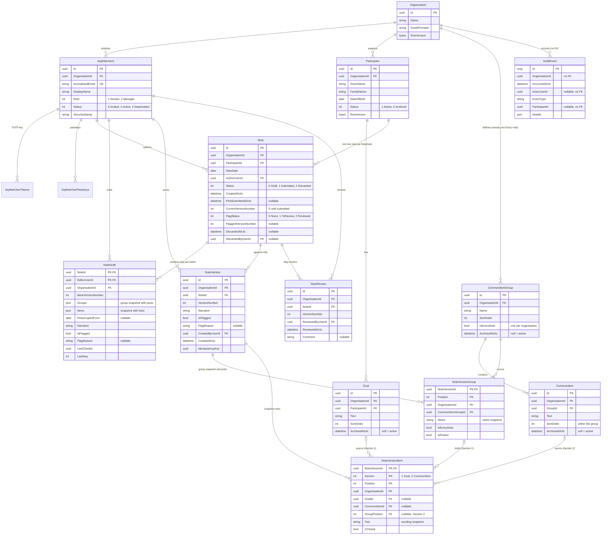
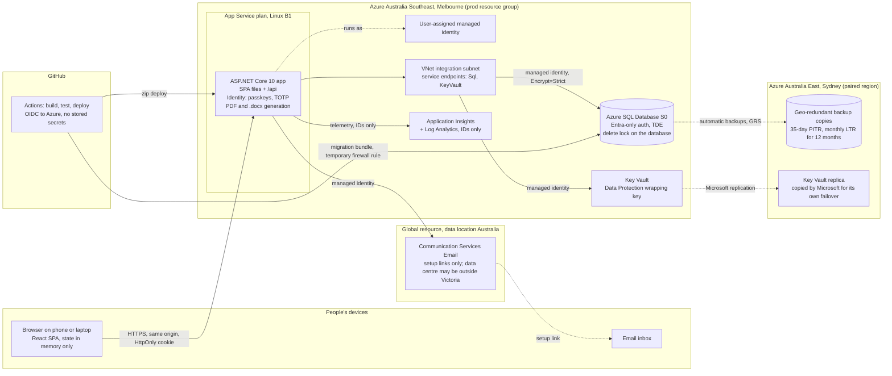

# Grow2Notes: system design

Grow2Notes is a small web app that replaces the daily Word progress-note template used by a registered NDIS provider in Victoria with fewer than 20 support workers. A worker writes one note per participant per day, on a phone or a laptop. Each note has the same three sections the organisation uses today: **Goals** (the participant's own goals, one tick box each), **Common items** (everyday activities or items worth ticking off that are not goals; configured like goals, but shared by every participant and organised into groups such as Community outing or Personal care: the built-in **Every note** group always shows, and the writer ticks which other groups happened that day, so only those groups' items show) and **Guided notes** (one free-text box, with the organisation's prompts shown as placeholder text). A "Flag for manager" tick box with a short reason sits underneath. Drafts autosave to the server, a note is final on submit, and every later edit is kept as a version. Managers set up participants, goals, common items and their groups, prompts and users, review flagged notes, write notes that were forgotten on a past day, and download the daily report as a Word or PDF file. It is one ASP.NET Core app serving a React single-page app, with one Azure SQL database, hosted in Azure Australia Southeast (Melbourne) so primary data stays in Victoria, with geo-redundant backup copies in Australia East (Sydney). It costs about AUD 62–65 a month ex GST for test and production together (estimate). It deliberately does nothing else: no claims, rostering, incidents, notifications or AI in the app. Release 2 adds a separate admin MCP server that managers and the operator's support account can use with an AI assistant (§1).

## Decisions

The product owner's decisions D1–D70 are recorded in [decisions.md](decisions.md). They are final; D9 and D11 are amended by D44, D28 and D31 by D48, D60 by D65, and D61 by D63. Release 2's admin MCP server (D48–D51, D55–D59) is designed in [mcp-server.md](mcp-server.md). This document cites them as (D6), (D35) and so on, and does not reopen them. Everything else this design had to decide is listed once in §13 Assumed defaults (A1–A51), which the owner can override. There are no open questions (§15).

The app is called Grow2Notes, and that is the only name a user ever sees: on screens, page titles, the setup email, exported files, the session cookie, the passkey's relying-party name and the authenticator-app issuer. The parent company's name never appears in the app (D42).

The developer's business owns the Azure subscription that hosts test and production, an existing subscription that also runs the operator's other workloads (D60), and operates Grow2Notes for the provider (D40). Where this document says "the developer" or "the operator", it means that business.

---

## 1. Scope

### In scope (v1)

- Accounts by email invite only, with MFA for everyone: a passkey, or a password plus an authenticator app (D23).
- Two roles, Worker and Manager (D24).
- A **Today** screen listing every active participant, with the status of today's note where one exists, and a search box (D20).
- The note: Goals, Common items, Guided notes and Flag for manager. Common items are in groups: the Every note group always shows, and the writer ticks which other groups happened that day, starting from the groups picked on the participant's most recent note (D44–D46). Drafts autosave to the server, then the note is submitted (D6–D12, D18, D22, D34).
- Edits to a submitted note by its author or a manager. Every version is kept (D15, D19).
- Past-day notes, written by a manager when a note was forgotten (D35).
- A flagged-notes review list for managers, with a count badge inside the app (D17, D18).
- Read-only past notes for any participant, open to every user (D20).
- A daily report of the day's notes as written. Managers only, downloaded as a Word (.docx) or PDF file; it is not shown on screen (D26–D30, D43).
- Manager setup: participants and their goals, common items and their groups, guide prompts and users (D8–D12, D34, D44, D45).
- A participant record export, for access and correction requests (A30).
- An append-only audit log, with no screen in v1 (A28).
- Works on phone and laptop and meets WCAG 2.2 AA (D5, A32).

**Release 2** (after go-live, D55): an admin MCP server through which managers and the operator's support account make admin changes with an AI assistant, never seeing note content (D48–D51); see [mcp-server.md](mcp-server.md).

### Out of scope

| Not in the app | Reason, or where it lives |
|---|---|
| Claim evidence: times, hours, support items, line items, invoicing | Timesheets and invoicing (D14) |
| Rostering, shift allocation, "my participants" lists | No rostering (D14); every worker sees every participant (D20) |
| Incident reports or an incident register | Existing incident forms, outside the app (D16) |
| Missing-note detection, reminders, overdue lists | D25 |
| Email, SMS or push notifications; emailing reports | Flag alerts are in-app only (D18); reports are downloaded from the app (D30, D43). The only email the app sends is a setup link for an invite or a sign-in reset (A23). |
| Sharing reports or records outside the organisation through the app | D28. A manager exports a file and hands it over outside the app. |
| Statistics, totals, counts, charts, dashboards, trends | D26 |
| Weekly, monthly or custom-period reports | D27 |
| Reading the daily report on screen | D43. Managers download it as a Word or PDF file. |
| AI in the app | None in the app (D31). Release 2 adds an admin MCP server for managers and the support account only, never for workers and never with note content (D48, D49, [mcp-server.md](mcp-server.md)). |
| An in-app dictation button | Phone keyboard dictation works in the text box (A31). Browser speech APIs send audio to the browser vendor by default. |
| A group-support screen, or one note covering several participants | D36 |
| More than one note or more than one worker per participant per day | D6, D13 |
| Workers writing notes for a past or future date | D35 |
| Offline mode, drafts stored on the device, native apps | D22, D5 |
| Goal hierarchies, ratings, progress scales, targets | D7, D8 |
| A manager setting different common items for a participant, or hiding items or groups for a participant | D11, D44. Every group can be picked on any participant's note; the writer picks the groups on each note. |
| Structured guided-note fields; prompts that stay visible while typing | D12, D34 |
| Integrations, sync, importing old Word notes | D4, D41, A39 |
| Self sign-up; more than one organisation in the UI | D3 (data model only) |
| Single sign-on or social login | D23 |
| Self-service password reset or changes to sign-in methods | One recovery path: a manager's Reset sign-in (A22, A23) |
| Jurisdictions other than Victoria | D37 |
| Not requested, so not built: attachments or photos, a handover box, copying yesterday's note forward (only the common item group picks are copied, D46), a participant or family portal, a consent register, worker-screening tracking, an audit-log screen, hard delete or a records-destruction screen | The owner's simplicity rule |

---

## 2. Roles & permissions

| Action | Worker | Manager | Support (Release 2) |
|---|---|---|---|
| Sign in (MFA required) | Yes | Yes | Yes |
| See Today: every active participant and today's note status | Yes | Yes | No |
| Write today's note for any active participant | Yes | Yes (A7) | No |
| Write a note for a past date (only if that date has no note) | No | Yes | No |
| Write a note for a future date | No | No | No |
| Continue and submit their own draft, including one from an earlier day | Yes | Yes | No |
| See someone else's draft | Status only: "Draft · name · started 9:14 am" | Read-only | No |
| Discard a draft (kept hidden; frees the day) | Their own | Any | No |
| Read any submitted note, for any participant and date | Yes | Yes | No |
| Edit a submitted note (creates a new version) | Their own | Any | No |
| See the "Edited" label on a note | Yes | Yes | No |
| See version history | No | Yes (A13) | No |
| Flag a note for a manager | Yes | Yes | No |
| See the Flagged list and badge, mark Reviewed, read review comments | No | Yes | No |
| Download the daily report (Word or PDF) | No | Yes | No |
| Export one participant's record | No | Yes | No |
| Add, edit, reorder, archive or restore participants and their goals | No | Yes | Through MCP only |
| Add, edit, reorder, archive or restore common items, or move an item to another group | No | Yes | Through MCP only |
| Add, rename, reorder, archive or restore common item groups (not the built-in Every note group) | No | Yes | Through MCP only |
| Edit the guide prompts | No | Yes | Through MCP only |
| Invite users; change a user's name, email or role; reset sign-in; deactivate; reactivate | No | Yes | Through MCP only: invite workers; reset sign-in or deactivate worker accounts; always with a reason |
| Connect an AI assistant to Grow2Notes (Release 2) | No | Yes | Yes |
| Delete anything; change a note's date or participant | No | No | No |

Support is a Release 2 role for the operator's support person (D50, D57, D58). It has no app screens beyond sign-in and connecting an AI assistant; see [mcp-server.md](mcp-server.md) §2.

**How it is enforced.** Requests are denied by default: the fallback authorisation policy requires a signed-in, active user whose role is Worker or Manager, named exactly. No check infers a role from "not Manager" or "not Worker", so Release 2's Support role is refused everywhere it is not named (mcp-server.md §3.5). Manager-only endpoints carry a `Manager` policy on the role claim. Rules that depend on the record (author or manager, note date, note status) are checked in the handler against the loaded record. A table-driven integration test lists every endpoint from ASP.NET Core's `EndpointDataSource` and calls each one four ways: anonymous, worker, manager, and a manager of a second organisation (Release 2 adds a fifth caller, Support). It asserts the expected 401, 403, 404 or 2xx. A new endpoint without a row in that table fails the build.

---

## 3. Core rules

### 3.1 What a note contains

| # | Section | What it holds | Set up by | Result |
|---|---|---|---|---|
| 1 | **Goals** | The participant's own goals, as a flat list (D8) | Managers, per participant | One tick box per goal; ticked = reached (D7) |
| 2 | **Common items** | Other everyday activities or items that get ticked off but are not goals, for example "Medication prompted" or "Meal prepared". Set up like goals, but organisation-wide and organised into **groups**, for example Community outing, In-home support or Personal care (D9, D11, D44). The built-in **Every note** group always shows (D45). The writer ticks which other groups happened that day, and only those groups' items show. Any group can be picked for any participant (D44) | Managers, once for the organisation: the groups and their items | One tick box per group that happened; one tick box per item shown; ticked = done (D10) |
| 3 | **Guided notes** | One free-text box. The organisation's guide prompts show inside it as placeholder text and disappear when typing starts (D12, D34) | Managers set the prompt text | The text as written |

A new note starts with the same groups picked as the participant's most recent submitted note, and the writer can change them (D46, A44). Only the group picks are copied, never the item ticks. Which groups are picked is part of the note, like the ticks.

Under the three sections sits a **Flag for manager** tick box, which needs a short reason when ticked (D18).

A note holds no times, hours or support items (D14).

### 3.2 One note per participant per day

- Each participant has at most one live note (Draft or Submitted) for each note date (D6). The database enforces this with a filtered unique index, not only the screen (§5.3). A discarded draft does not count.
- Only one worker supports a participant on any day (D13), so whoever makes the first change owns the note. Anyone else who opens that participant sees who started it and when, and cannot start a second note.
- Group supports get a separate note for each participant (D36).

### 3.3 Note date and "today"

- "Today" is the current date in Australia/Melbourne, worked out on the server, never from the device clock (D37, A33). Timestamps are stored in UTC and shown in Melbourne time.
- Workers can only write a note dated today, so the worker's form has no date picker (D35). Managers can write today's note or a past-day note. Nobody can write a note for a future date.
- A draft is created at the first change, not when the form opens, so a mis-tap creates nothing. The note date is fixed at that moment and never changes, even if the note is submitted after midnight or on a later day (A8).
- If the form was opened before midnight and the first change happens after midnight, the server refuses to start yesterday's note for a worker. The text stays on screen with the message: "It's now after midnight, so this note can't be started for yesterday. Ask a manager to record it."

### 3.4 Draft and submit

```
(no note) --first change--> Draft --Submit--> Submitted (version 1) --Save changes--> version 2 --> version 3 ...
Draft --Discard (author or manager)--> Discarded (kept, hidden, audited; frees the day)
```

| State | Who sees the content | Blocks a second note for that day |
|---|---|---|
| Draft | The author; managers, read-only. Other workers see "Draft · name · started time" only. | Yes |
| Submitted | Everyone sees the current version; managers also see earlier versions | Yes |
| Discarded | Nobody in the app; kept in the database and audited | No |

- **Autosave.** A draft saves to the server about 2 seconds after the last change, when a field loses focus, and when the page is hidden (for example, switching apps on a phone). Nothing is stored on the device (D22). If a save fails, a banner says the note is not saved and the page keeps retrying. Submit stays disabled until the save succeeds.
- **To submit,** the Guided notes box must not be empty, and a flagged note needs a reason. Ticks are optional: unticked means not reached or not done (A4, A8). No common item group has to be picked (A45).
- **Final on submit** (D17). There is no approval step. A submitted note appears at once in the daily report and in participant history.
- **Snapshot** (A3). When the draft is created, it stores the wording and order of the participant's active goals, and the common item groups: the Every note group and every active group, each with its name and its active items' wording and order. Ticks and group picks are recorded against that snapshot, and submit copies it into the version. Later changes to the goals, the common items or their groups affect only notes started afterwards, so old notes and reports keep their groups and wording.
- **Group picks** (D44–D46). The picks the form starts with (copied from the participant's most recent submitted note, A44) are not saved by opening the form. The first change of any kind creates the draft with the picks on screen. After that, picks autosave with the draft like ticks. Unpicking a group clears that group's ticks on this note (A46).
- **Earlier-day drafts.** A draft started on an earlier day can still be submitted by its author. It keeps its note date, and the real submit time is recorded and shown.
- **Discard** (A9). The author or a manager can discard a draft. The draft is kept in the database, hidden from every screen, and audited. The participant's day is free again.

### 3.5 Editing and versions

- **Who:** the note's author or any manager (D19). Other workers can only read.
- **When:** any time after submit; D19 sets no time limit. The note date and participant never change.
- **How:** "Edit" opens the submitted note. Changes autosave on the server as a **pending edit** that only the editor sees. Everyone else keeps seeing the current version until the editor taps **Save changes**, which creates exactly one new version recording who saved it and when. **Cancel** throws the pending edit away; the submitted note is unchanged (A10).
- An edit keeps the goals, common item groups and common items of the version being edited, with the same names, wording and order, including a group archived since. Only the ticks, the group picks, the text and the flag change, and the new version records all of them. A goal, group or item added later never appears in an old note.
- Versions can only be added. No version is ever changed or removed. Version 1 is the note as submitted. Draft autosaves are not versions.
- Everyone sees an "Edited" label with the last editor and time. The full version history is shown to managers only (A13).
- If someone else saved a version while you were editing, your save is blocked and you are shown the newer version, with your text still on screen, so you can apply your change again. Nothing is silently overwritten.

### 3.6 Flagging and review

- The writer ticks **Flag for manager** and enters a short reason, required, up to 200 characters (D18, A6).
- Managers are alerted only when the note is submitted; a flag on a draft is not seen. The note goes into the **To review** list and adds to the count badge every manager sees. There is no email, SMS or push alert (A14).
- Any manager can open the note, edit it if needed, and **Mark reviewed** with an optional comment. The app records who reviewed it and when. One review is enough, because managers are equal (D24).
- A submitted flag stays in To review until a manager reviews it, even if a later edit removes the tick. If a later edit adds a flag or changes the reason, the note goes back to To review (A15).
- A flag is not an incident report. Incidents go through the existing forms (D16).
- **Spot-checks** (D17): managers read any note in a downloaded daily report or in participant history. There is no separate spot-check status (A16).

### 3.7 Archiving: nothing is deleted

| Item | Effect of archiving | Restore |
|---|---|---|
| Goal | Not shown on notes started from now on. Existing notes keep their snapshot. | Returns at the end of the list |
| Common item | Same as a goal, for every participant | Returns at the end of its group |
| Common item group | No longer offered on notes started from now on, so none of its items show there. Existing notes keep their snapshot. The Every note group cannot be archived (A43). | Returns at the end of the groups, with its active items |
| Participant | Removed from Today and search. No new notes, including past-day notes. History, reports and exports are unchanged. A draft already started can still be submitted. | Back on Today |
| User (deactivate) | All their sessions end at once and they cannot sign in. Their notes keep their name. Their open drafts stay until a manager discards them. | Reactivate |

- Rewording a goal or common item, renaming or reordering a group, or moving an item to another group only affects notes started from then on. Rewording is for typos and clarifications; for a genuinely different goal, archive the old one and add a new one.
- The app has no hard delete. Destroying records after the retention period is a manual, logged task outside the app (A29, §12).

### 3.8 Past-day notes (managers)

- A manager can write a forgotten note for a past date if that participant has no live note for that date (D35). The manager is recorded as the author. The note shows both the note date and "Past-day note, written on [date, time] by [manager]" everywhere it appears (A11). It uses the same form and lifecycle as any other note.
- If the date already has a note, the manager is taken to it, and can edit it if it has been submitted.
- A manager can also edit any submitted note from any date, discard any draft (for example one left by a deactivated worker), and download the daily report for any past date.
- Nobody can change a note's date or participant, edit an old version, or delete anything.

### 3.9 A note on the wrong participant

- **Prevention:** the participant's full name is shown in the form header, in the submit confirmation and on the submit button.
- **Draft on the wrong participant:** the author or a manager discards it, then writes the right note.
- **Submitted note on the wrong participant** (D39, A12): the author or a manager edits it. The new version replaces the content with what is correct for this participant: either the real note for that day, naming who supplied it, or "Recorded against this participant in error. No support recorded here." The wrong content stays in the version history, which only managers see (a restricted record under HPP 6.7). The other participant's own note is written in the normal way, because their day is not affected. Before a participant record export that includes earlier versions is handed over, the manager removes the other person's information (§11.6).
- Known limitation, accepted by the owner (D39): the note's author stays the person who first wrote it.

---

## 4. Screens & flows

### 4.0 Navigation and shared behaviour

- **Layout.** Designed for phones first, in a single column. On a laptop the same screens get wider; the setup screens use the extra space.
- **Worker navigation:** Today, and an account menu with Sign out.
- **Manager navigation:** Today, Flagged (with badge), Report, and Manage (Participants, Common items, Guide prompts, Users).
- **Accessibility** (A32). Plain-English labels. Tap targets at least 44 × 44 px. The focus outline is always visible. Text can be enlarged to 200%. Status is always given in words, never by colour alone.
- **Times** are shown in Melbourne time, for example "4:12 pm".
- **Sessions** (A24). After 30 minutes without activity the user is signed out. At 28 minutes a dialog says "You'll be signed out in 2 minutes" with **Stay signed in**. Drafts are already saved on the server. After signing in again the user returns to the same note. Nothing is kept on the device.
- **Page titles and URLs** contain no names: titles are generic ("Grow2Notes – Note") and URLs hold only IDs and dates, so browser history on a personal phone shows no participant names.

### 4.1 Sign-in and account setup

**Purpose:** let invited people in, with MFA always on (D23).

**Setting up an account** from the emailed setup link (single use, valid 7 days, A23):
1. "Set up your account": name (from the invite) and email (fixed).
2. Choose **Use a passkey (recommended)** or **Use a password and authenticator app**.
3. Passkey: the device's passkey prompt (Face ID, fingerprint or device PIN), then done.
4. Password: set a password of at least 12 characters, with show/hide. Scan the QR code, or type the setup key, into an authenticator app, then enter the 6-digit code.
5. The user lands on Today.

**Signing in:** "Sign in with a passkey", or email and password followed by the 6-digit code. Then Today.

| Situation | What the user sees |
|---|---|
| Setup link expired, used or replaced | "This link has expired. Ask a manager to send a new one." |
| Setup page left open for more than 30 minutes | "Your setup session timed out. Open the link from your email again." |
| Wrong password or code, a locked or deactivated account | Always the same message: "Sign-in failed. Check your details and try again. After 5 failed attempts, sign-in pauses for 15 minutes." It never says which part was wrong, whether the account exists, or whether it is locked (A25). |
| Phone's in-app email browser can't create passkeys | "Open this link in your browser", or use the authenticator-app option |

- MFA cannot be skipped, and there is no "remember this device" (A22).
- A lost phone or forgotten password is fixed by a manager's **Reset sign-in** (4.11), which sends a new setup link.

**Primary action:** Sign in / Finish setup.

### 4.2 Today (home for everyone)

**Purpose:** start or continue today's note for any participant, and see what has been done today.

**On screen, in order:**
1. Header: "Today · Thursday 1 October".
2. **Your unfinished drafts**, shown only when this user has a draft or pending edit that is not on today's list (one from an earlier day, or for a participant archived since). Each shows the participant and note date. Tap to continue.
3. Search box, "Find a participant", filtering by given or family name as you type.
4. Every active participant, sorted by family name then given name (A5). A status is shown only when a note exists (A17):
   - *(no status)*
   - *Draft · You · saved 9:42 am*
   - *Draft · Alex P. · started 9:14 am*
   - *Submitted · Alex P. · 4:12 pm*, with a "Flagged" tag if the current version is flagged

**What tapping a participant does:**
- No note yet: opens an empty note form. No draft exists until the first change.
- Your own draft: opens the form.
- Someone else's draft: "Alex P. started today's note for Jane Citizen at 9:14 am. Only Alex can finish it." Managers see the draft read-only, with Discard (for example, when Alex has left it unfinished).
- Submitted: opens the read view (4.4). Edit is offered to the author and to managers.

**States:**
- No participants: "No participants yet." Managers also see "Add participant".
- No search match: "No participant matches 'xyz'".
- There are no counts, no "missing" markers and no "not started" labels (D25).

**Primary action:** tap a participant.

### 4.3 Note form

**Purpose:** write one participant's note for one date.

**On screen, in order:**
1. Top bar: back to Today, and the save indicator.
2. The participant's full name in large type, and the note date. On a manager's past-day note, a banner: "Past-day note for Mon 28 Sep 2026, written on 1 Oct."
3. **1. Goals.** The participant's goals as full-width tick-box rows. Ticked means reached.
4. **2. Common items.** "Ticked means done." Then, in this order, all as full-width tick-box rows (`ux/components/group-picker.md`):
   - **Every note:** that group's items, always shown (D45).
   - **The groups:** the question "Which of these happened?" with the hint "Tick all that happened. Their items show below.", then one tick box per group that has items, in the managers' order. On a new note the groups picked on the participant's most recent submitted note are already ticked (D46, A44), with a line naming that note's date (A47), for example "These ticks are copied from the note for Wednesday 30 September 2026. Untick any that did not happen." Only group picks are copied; item ticks never are.
   - **Each picked group's items,** as its own list under the group's name, in the managers' order (never the order they were ticked).

   Ticking a group shows its items, unticked. Unticking it hides them and clears their ticks, with no confirmation (A46). Focus stays on the tick box and nothing scrolls. Workers never see the word "group".
5. **3. Guided notes.** A permanently visible label and one text box that grows as you type. The guide prompts show in grey until typing starts (D34). The box is large enough for phone keyboard dictation (A31).
6. **Flag for manager** tick box. When ticked, a Reason field appears (required, up to 200 characters).
7. **Submit note** button. A menu holds "Discard draft".

**Save indicator:** "Saving…" / "Saved 9:42 am" / "Not saved: no connection. Keep this page open; retrying." Submit is disabled while the latest change is not saved.

**States:**
- **New:** nothing saved yet.
- **Draft:** "Draft · saved 9:42 am".
- **Draft from an earlier day:** banner "This draft is for Wed 30 Sep. Submitting it now keeps that date."
- **Group picks copied from the last note** (A47): the copied-picks line shows on a new note, and on a draft, whenever at least one group was ticked from the participant's most recent submitted note. It stays after the writer changes picks and after a reload. It never shows when editing a submitted note or in the read view. With no earlier submitted note, or none of its groups still offered, nothing is ticked and the line does not show.
- **Lists changed before the first save:** if a manager changed the goals, the common items or their groups between the form opening and the first change, the form reloads the lists, keeps the text and any picks and ticks that still apply (a tick on an item moved into an unpicked group is dropped), and says "The goal or common-item list was just changed. Please check your ticks."
- **Changed on another device or tab:** banner "This note was changed on another device or tab." with **Keep the text on this screen** or **Load the other version**. The text on screen is never replaced without asking.
- **Validation:** an empty Guided notes box or a missing flag reason shows an error next to the field, plus a summary at the top when Submit is tapped.
- **No goals set up:** "No goals set up for Jane yet. A manager can add them." The note can still be submitted.
- **No common items set up:** "No common items set up." If only the Every note group has items, there is no question. If the Every note group has no items, it is not shown. A group with no items is not offered (A45).
- **Editing a submitted note** (author or manager): the same form, headed "Editing submitted note (version 2)", with **Save changes** and **Cancel**. It shows the version's groups and picks, including a group archived since, and the picks can be changed. No copied-picks line. With no common items: "No common items set".
- **Discard draft:** asks "Discard the draft note for Jane Citizen?" first.

**Primary action:** Submit note, which opens the confirmation below.

**Phone sketch:**

```
+-----------------------------------+
| < Today             Saved 9:42 am |
|                                   |
| JANE CITIZEN                      |
| Thursday 1 October 2026           |
+-----------------------------------+
| 1. Goals                          |
| [x] Makes own breakfast           |
| [ ] Catches bus to day program    |
| [x] Phones her sister             |
+-----------------------------------+
| 2. Common items                   |
| Ticked means done.                |
|                                   |
| Every note                        |
| [x] Medication prompted           |
| [ ] Meal prepared                 |
|                                   |
| Which of these happened?          |
| Tick all that happened. Their     |
| items show below.                 |
| These ticks are copied from the   |
| note for Wednesday 30 September   |
| 2026. Untick any that did not     |
| happen.                           |
| [x] Community outing              |
| [ ] In-home support               |
| [ ] Personal care                 |
|                                   |
| Community outing                  |
| [x] Travelled by bus or train     |
| [ ] Paid for own purchases        |
|  (only picked groups' items show) |
+-----------------------------------+
| 3. Guided notes                   |
| +-------------------------------+ |
| | Mood and wellbeing today?     | |
| | What did you do together?     | |
| | Anything to follow up?        | |
| |                               | |
| +-------------------------------+ |
|  (grey prompts vanish on typing)  |
+-----------------------------------+
| [ ] Flag for manager              |
|     Reason (shows when ticked)    |
|     [___________________________] |
+-----------------------------------+
| [          Submit note          ] |
+-----------------------------------+
```

**Submit confirmation,** naming the participant to prevent notes on the wrong person:

```
+-----------------------------------+
| Submit today's note for           |
|                                   |
| JANE CITIZEN                      |
| Thursday 1 October 2026           |
|                                   |
| Flagged for manager: No           |
|                                   |
| [ Submit note for Jane Citizen ]  |
| [ Go back ]                       |
+-----------------------------------+
```

After submitting, the user returns to Today with "Note for Jane Citizen submitted", and the row shows Submitted.

### 4.4 Participant notes (history) and the read view

**Purpose:** read past notes for one participant (D20).

**How to get here:** the "Past notes" link in the note form and read view, or Manage > Participants.

**On screen, in order:**
1. Participant name. Managers also see Write past-day note, Export record and Edit participant.
2. Notes, newest first: date, author, status (Draft or Submitted) and tags (Edited, Flagged; managers also see To review or Reviewed). 30 at a time, then "Show older".

**Read view of one note:**
- Every goal from the note's snapshot, shown as ticked or not ticked.
- Common items (D47): the Every note group, then each group picked on the note, under the group's name in the managers' order, each item shown as ticked or not ticked. Groups not picked, the "Which of these happened?" question and the copied-picks line do not appear. If no common items are shown: "No common items set".
- The Guided notes text, the flag and its reason, the author, and the submitted time (with its date when it was a later day).
- "Past-day note, written on … by …" where it applies, and the "Edited" label.
- Managers also see the review status and comment, and a "Version history" link.
- Actions: Edit (author or manager); Mark reviewed (manager, when the note is in To review).

**States:**
- No notes: "No notes yet for Jane Citizen."
- Someone else's draft: status only for workers, read-only for managers.

**Primary action:** open a note.

### 4.5 Version history (managers)

**Purpose:** show every version of a submitted note, with who saved it and when (D15, D19).

**On screen:**
1. Participant, note date, current version number.
2. Versions, newest first, for example "Version 3 · Sam Lee (manager) · 1 Oct 2026, 5:03 pm". Version 1 is labelled "Submitted".
3. Tapping a version shows it in full, read-only, laid out like the read view, with the groups picked in that version.

**States:** only one version: "Not edited since submit".

**Primary action:** open a version. There is no restore; to bring old wording back, a manager edits the note.

### 4.6 Flagged notes (managers)

**Purpose:** make sure every flag is seen and dealt with (D17, D18).

**On screen:**
1. Tabs: **To review (n)** | **Reviewed**.
2. To review, oldest first: participant, note date, author, the first line of the flag reason and when it was flagged. If a later edit removed the tick, the row says "Flag removed in a later edit".
3. Opening one shows the read view with a review panel underneath: an optional comment (up to 500 characters) and **Mark reviewed**.
4. Reviewed, newest first, 30 at a time: also shows the reviewer, the time and the comment.

**Badge:** the To review count shows on the Flagged menu item on every manager screen. It refreshes when a page loads and when the window regains focus; there is no push.

**States:** empty: "No flagged notes to review."

**Primary action:** Mark reviewed.

### 4.7 Daily report (managers)

**Purpose:** pick a day and download that day's notes as one Word (.docx) or PDF file (D26–D30, D43). The report is never shown on screen. The file's content and layout are in §11.

**On screen, in order:**
1. **Previous day**, a native date field and **Next day**. The screen opens on today's date (Melbourne). Future dates cannot be picked, so Next day is disabled on today.
2. **Download Word** and **Download PDF**.

The screen URL is `/reports/daily/2026-10-01`: a date only, so back, forward and bookmarks work and no personal data is in the URL.

**States:** no submitted notes for the chosen day: "No submitted notes for Thursday 1 October 2026." Both download buttons are disabled.

**Primary action:** Download Word / Download PDF.

### 4.8 Participants and goals (managers)

**Purpose:** keep the participant list and each participant's flat list of goals (D8).

**List screen:** search, an Active / Archived toggle, names, and "Add participant".

**Participant detail, in order:**
1. **Details:** given name, family name, date of birth (A5). Save.
2. **Goals:** the active goals in order. Each row has Edit, Move up, Move down and Archive. "Add goal" takes up to 200 characters. Archived goals sit in a collapsed section, each with Restore. Help text: "Changes apply to notes started from now on. Notes already started or submitted keep the wording they were written with."
3. **Actions:** Past notes (4.4), Write past-day note, Export record (4.12), Archive participant or Restore.

**Write past-day note:** a date field allowing past dates only. If that date already has a note, it opens; otherwise the note form (4.3) opens for that date with the past-day banner.

**States:**
- No goals yet: "Notes will show an empty Goals section."
- Archived participant: a read-only banner with Restore.

**Primary action:** Save / Add goal.

### 4.9 Common items (managers)

**Purpose:** keep the organisation-wide common items (everyday activities or items that are ticked off but are not goals), organised into groups (D9–D11, D44, D45). The layout is in `ux/components/group-picker.md` (Manager side).

**On screen, in order:**
1. Help text: "Items in Every note show on every note. For other groups, the writer ticks the ones that happened. Changes apply to notes started from now on."
2. **Every note,** always first, with the line "Always shown first, on every note." It has no group buttons: it cannot be renamed, moved or archived (A43).
3. One section per active group, in order, headed with the group's name, with **Move up**, **Move down**, **Rename** and **Archive**. Rename uses one field, "Group name", up to 200 characters.
4. In every section, the same item list as before: active items, each with Edit, Move up, Move down and Archive; a "New item in [group name]" field (up to 200 characters) with **Add item**, which adds at the end of that group; and the group's archived items, collapsed, each with Restore.
5. "New group" (up to 200 characters) with **Add group**. The new group goes at the end, empty.
6. Archived groups, collapsed, each with Restore. A restored group returns at the end of the groups with its active items.

**Moving an item:** the item's Edit has the wording and a "Group" set of radio buttons listing every active group, with its current group selected. A moved item goes to the end of its new group (A42).

Nothing is dragged, deleted or confirmed: archiving a group or an item asks nothing, because it can be restored. The snapshot and archiving rules are the same as for goals (3.4, 3.7).

**States:**
- A group with no active items: "No items in this group. It does not show on notes until it has one."
- Rename or New group left empty: "Enter the group name". Too long: "Group name must be 200 characters or less".

**Primary action:** Add item.

### 4.10 Guide prompts (managers)

**Purpose:** set the placeholder text shown in the empty Guided notes box (D12, D34).

**On screen:** one multi-line field, "Guide prompts", up to 1,000 characters, and Save.

**Help text:** "Prompts are a guide only. They disappear as soon as someone starts typing and are not saved into notes."

Changes apply straight away to every empty Guided notes box, including open drafts. The grey placeholder text meets 4.5:1 contrast, and the box keeps its visible "Guided notes" label.

**States:** no prompt text: the box shows no placeholder. Leaving with unsaved changes shows a warning.

**Primary action:** Save.

### 4.11 Users (managers)

**Purpose:** control who can sign in and in which role (D23, D24).

**List:** name, email, role, status (Invited / Active / Deactivated), and "Invite user".

**Invite user:** name, email and role (Worker or Manager), then "Send invite". The email contains a setup link that works once and lasts 7 days.

**User detail actions:**
- **Edit** name, email or role. Changing the email resets sign-in and sends a setup link to the new address.
- **Resend invite** (while Invited).
- **Reset sign-in** (while Active): removes the password, authenticator and passkeys, ends every session, and emails a new setup link. The manager confirms who is asking before doing this, by phone or in person.
- **Deactivate.** The confirmation says: "[Name] will be signed out everywhere now and can't sign in. Their notes stay."
- **Reactivate.**

**Rules:**
- An email address can be used for only one account in the whole app (A27).
- The last active manager cannot be deactivated, made a worker or reset (A26).
- Users are never deleted.

**Primary action:** Invite user.

### 4.12 Participant record export (managers)

**Purpose:** answer a participant's (or their representative's) request to see their records (APP 12, HPP 6). Content is in §11.6.

**On screen (participant detail > Export record):**
1. Participant (fixed).
2. From date and To date. Defaults: the participant's first note to today.
3. Format: PDF or Word.
4. "Include earlier versions of edited notes", off by default (A20).
5. Export.

**States:**
- No notes in the range: "No submitted notes for Jane Citizen between … and …".
- To date before From date: an error next to the field.

**Primary action:** Export.

### 4.13 Key flows

| Flow | Steps |
|---|---|
| Write today's note | Sign in → Today → search → tap participant → tick goals → tick Every note items, check the groups copied from the last note and tick the ones that happened, tick their items → type guided notes (autosaves) → Submit → confirm by name → back to Today, showing Submitted |
| Flag | Writer ticks Flag and gives a reason → submits → the managers' badge goes up → a manager opens Flagged → reads (and edits if needed) → Mark reviewed |
| Forgotten note | Manager → Participants → participant → Write past-day note → pick date → form → Submit (manager recorded as author; written-on time shown) |
| Correct a note | Author or manager opens the note → Edit → Save changes → new version (managers can see the history) |
| Wrong participant | Draft: Discard. Submitted: edit it to the correct content (3.9), then write the other participant's note. |
| Daily report | Manager → Report → pick date → Download Word or Download PDF |
| Access request | Manager → Participants → participant → Export record → dates and format → Export → review and redact the copy → hand it over outside the app |
| Lost phone | Worker tells a manager → manager confirms who they are → Reset sign-in → worker opens the new setup link and sets up again |

---

## 5. Data model

### 5.1 Conventions

| Topic | Rule |
|---|---|
| Database | Azure SQL Database (Australia Southeast), EF Core 10 on .NET 10. Column types below are SQL Server types. |
| Table names | Tables are named after the entity, in the singular (`Note`, `NoteVersion`), set by a model-building convention. ASP.NET Core Identity tables keep their `AspNet…` names. |
| Primary keys | `Guid` (`uniqueidentifier`), generated by EF Core's default sequential GUID generator on the client to avoid index fragmentation. The exception is `AuditEvent.Id`, a `bigint` identity. |
| Timestamps | Every column named `*Utc` is a UTC `DateTime` stored as `datetime2(3)`. A value converter sets `DateTimeKind.Utc` on read. The UI shows Melbourne time. |
| Calendar dates | `DateOnly` stored as `date`. `NoteDate` is a calendar date in Melbourne. "Today" always comes from the server (`MelbourneClock.Today()`, built on `TimeProvider`). |
| Enums | Stored as `tinyint`, with explicit numeric values so they can never be renumbered. |
| Length limits | One constants class drives both the column sizes (`HasMaxLength`) and request validation, so they cannot drift apart (A6). |
| Concurrency | Configuration rows (Organisation, Participant, Goal, CommonItemGroup, CommonItem) have `RowVersion` (`rowversion`), exposed as an `ETag`. Users use Identity's `ConcurrencyStamp`. Notes use conditional updates on the version number (5.8); working copies use a client ID and sequence number (5.6). |
| Tenancy | Every tenant-owned table has `OrganisationId uniqueidentifier NOT NULL` and implements `ITenantOwned`. Every foreign key between tenant-owned tables is composite: it includes `OrganisationId` and points at an alternate key `(OrganisationId, Id)`. |
| Deletes | All foreign keys use `ON DELETE NO ACTION`. The app deletes rows from only three tables: `NoteDraft` (a pending edit cancelled, or a working copy turned into a version), and `AspNetUserTokens` and `AspNetUserPasskeys` (a sign-in reset). Everything else is kept (A29). |
| Append-only tables | `NoteVersion`, `NoteVersionGroup`, `NoteVersionItem`, `NoteReview` and `AuditEvent` implement `IAppendOnly`. This is enforced in the app and in the database (5.8). |
| Volumes | About 30 participants × 365 days is roughly 11,000 notes a year. Each version stores every group in its snapshot with all of that group's items, estimated at up to a few hundred thousand snapshot rows a year. Storing a full snapshot for every version, rather than differences, is cheap at this size and makes any version simple to show. |

Length limits (A6):

| Field | Limit | Column |
|---|---|---|
| Goal and common item wording (and their snapshots) | 200 | `nvarchar(200)` |
| Common item group name (and its snapshots) | 200 | `nvarchar(200)` |
| Flag reason | 200 | `nvarchar(200)` |
| Review comment | 500 | `nvarchar(500)` |
| Guide prompts | 1,000 | `nvarchar(1000)` |
| Guided notes text | 20,000 | `nvarchar(max)`, limit enforced by validation |
| Participant given and family name; user display name | 100 each | `nvarchar(100)` |

### 5.2 Entity-relationship diagram



### 5.3 Entities

#### Organisation (the tenant)

Not tenant-owned, because it is the tenant. Created by the `admin bootstrap` command (7.4), together with its Every note group; there is no sign-up screen. The time zone is not stored: it is always Australia/Melbourne (D37).

| Field | .NET type | SQL type | Null | Notes |
|---|---|---|---|---|
| Id | Guid | uniqueidentifier | no | PK |
| Name | string | nvarchar(200) | no | Printed on report and export headers. Set at bootstrap. |
| GuidePrompts | string | nvarchar(1000) | no | Default `''`. The placeholder text for the Guided notes box (D12, D34). Not copied into notes, because a placeholder is never part of what was written. |
| CreatedAtUtc | DateTime | datetime2(3) | no | |
| RowVersion | byte[] | rowversion | no | ETag for the Guide prompts screen. |

#### ApplicationUser (`AspNetUsers`) and the Identity tables

`ApplicationUser : IdentityUser<Guid>`. The context derives from `IdentityUserContext<ApplicationUser, Guid>` with `IdentitySchemaVersions.Version3`, which adds the passkey table. There are **no Identity role tables**: the role is one column. `ApplicationUser` is not `ITenantOwned` (see 5.9).

Columns added to `AspNetUsers`:

| Field | .NET type | SQL type | Null | Notes |
|---|---|---|---|---|
| OrganisationId | Guid | uniqueidentifier | no | FK to Organisation. Alternate key `(OrganisationId, Id)` is the principal for every composite user FK. |
| DisplayName | string | nvarchar(100) | no | Shown as author, editor and reviewer. |
| Role | UserRole | tinyint | no | `1 = Worker`, `2 = Manager` (D24). |
| Status | UserStatus | tinyint | no | `0 = Invited`, `1 = Active`, `2 = Deactivated`. Only Active users can sign in (checked in `CanSignInAsync`). |
| InvitedAtUtc | DateTime | datetime2(3) | no | |
| InvitedByUserId | Guid? | uniqueidentifier | yes | Null only for the bootstrapped first manager. |
| ActivatedAtUtc | DateTime? | datetime2(3) | yes | Set when setup completes. |
| DeactivatedAtUtc | DateTime? | datetime2(3) | yes | |

How the inherited Identity columns are used:
- `Email`, `UserName` and `NormalizedEmail` hold the email address. The default non-unique `EmailIndex` is replaced by a **unique** index on `NormalizedEmail`: one email, one account, across the whole app (A27).
- `PasswordHash` is null for passkey-only users.
- `TwoFactorEnabled` becomes true when a password user enrols TOTP. No endpoint turns it off, except a sign-in reset.
- `SecurityStamp` is rotated on deactivation, sign-in reset and setup completion. This ends sessions and invalidates setup links (§8).
- `LockoutEnd` and `AccessFailedCount` drive lockout. `ConcurrencyStamp` is the user-admin ETag. `EmailConfirmed` is set at setup completion. `PhoneNumber*` columns are unused.

Index: `(OrganisationId, Status)`.

Identity tables that hang off a user (no `OrganisationId` of their own):

| Table | Use |
|---|---|
| `AspNetUserTokens` | The authenticator (TOTP) key: `LoginProvider = "[AspNetUserStore]"`, `Name = "AuthenticatorKey"`. No recovery codes are generated. |
| `AspNetUserPasskeys` | WebAuthn credentials (schema Version3): `CredentialId` (PK), `UserId` and `Data` (JSON with the public key, name, created time, sign count and transports). |
| `AspNetUserClaims`, `AspNetUserLogins` | Created by `IdentityUserContext` but unused: no external logins; claims are built at each request (§8.4). |

The ASP.NET Core Data Protection key ring is stored in a `DataProtectionKeys` table in the same database through a separate small `KeysDbContext` with no tenant dependency (5.9). It is not tenant-owned.

There is no session table. Sessions are Identity cookies, checked against the security stamp on every request (§8).

#### Participant

| Field | .NET type | SQL type | Null | Notes |
|---|---|---|---|---|
| Id | Guid | uniqueidentifier | no | PK. Alternate key `(OrganisationId, Id)`. |
| OrganisationId | Guid | uniqueidentifier | no | FK to Organisation. |
| GivenName | string | nvarchar(100) | no | |
| FamilyName | string | nvarchar(100) | no | |
| DateOfBirth | DateOnly | date | no | Needed for the under-25 retention rule (A29). Shown to managers only. |
| Status | ParticipantStatus | tinyint | no | `1 = Active`, `2 = Archived`. Archived participants are hidden from Today and cannot get new notes; their notes stay readable. |
| ArchivedAtUtc | DateTime? | datetime2(3) | yes | Set on archive, cleared on restore. |
| CreatedAtUtc | DateTime | datetime2(3) | no | |
| RowVersion | byte[] | rowversion | no | |

Index: `(OrganisationId, Status, FamilyName, GivenName)`. Every list is sorted by family name, then given name (A5). No NDIS number or other government identifier is stored (A5, §12).

#### Goal (section 1 of a note)

The flat, per-participant list (D8). Managers configure it; each goal is one tick box (D7).

| Field | .NET type | SQL type | Null | Notes |
|---|---|---|---|---|
| Id | Guid | uniqueidentifier | no | PK. Alternate key `(OrganisationId, Id)`. |
| OrganisationId | Guid | uniqueidentifier | no | |
| ParticipantId | Guid | uniqueidentifier | no | FK `(OrganisationId, ParticipantId)`. |
| Text | string | nvarchar(200) | no | Current wording. Notes keep their own snapshot. |
| SortOrder | int | int | no | A reorder rewrites the active goals as 0..n-1. Not unique, so swaps need no temporary values. |
| ArchivedAtUtc | DateTime? | datetime2(3) | yes | Null means active. A restored goal goes to the end. |
| CreatedAtUtc | DateTime | datetime2(3) | no | |
| RowVersion | byte[] | rowversion | no | |

Index: `(OrganisationId, ParticipantId, ArchivedAtUtc, SortOrder)`.

#### CommonItemGroup (the groups in section 2 of a note)

The organisation-wide groups of common items, for example Community outing, In-home support or Personal care (D44). Any group can be picked on any participant's note. One built-in group, **Every note**, is always shown and cannot be unpicked (D45, A43).

| Field | .NET type | SQL type | Null | Notes |
|---|---|---|---|---|
| Id | Guid | uniqueidentifier | no | PK. Alternate key `(OrganisationId, Id)`. |
| OrganisationId | Guid | uniqueidentifier | no | |
| Name | string | nvarchar(200) | no | Current name. Notes keep their own snapshot. For the Every note group it is always "Every note". |
| SortOrder | int | int | no | Order of the groups other than Every note, which always comes first (lists sort by `IsEveryNote DESC, SortOrder`). Same reorder rules as Goal. |
| IsEveryNote | bool | bit | no | True only for the built-in Every note group. |
| ArchivedAtUtc | DateTime? | datetime2(3) | yes | Null means active. A restored group goes to the end. |
| CreatedAtUtc | DateTime | datetime2(3) | no | |
| RowVersion | byte[] | rowversion | no | |

Constraints:
- **Exactly one Every note group per organisation.** A unique index on `(OrganisationId)` filtered `WHERE [IsEveryNote] = 1` allows at most one. `admin bootstrap` creates it in the same transaction as the organisation, and rows are never deleted (5.8), so there is always exactly one. No endpoint creates a group with `IsEveryNote = 1`.
- **Every note is fixed.** Check constraint `IsEveryNote = 0 OR ArchivedAtUtc IS NULL`, so it can never be archived. The rename and archive endpoints refuse it (`422 config.every_note_fixed`), and the reorder endpoint does not accept its ID (`422 config.order_mismatch`).

Index: `(OrganisationId, ArchivedAtUtc, SortOrder)`.

#### CommonItem (section 2 of a note)

The organisation-wide everyday activities or items that are ticked off but are not goals (D9–D11). Each belongs to exactly one group (A42). Any group, and so any item, can be shown on any participant's note (D44).

| Field | .NET type | SQL type | Null | Notes |
|---|---|---|---|---|
| Id | Guid | uniqueidentifier | no | PK. Alternate key `(OrganisationId, Id)`. |
| OrganisationId | Guid | uniqueidentifier | no | |
| GroupId | Guid | uniqueidentifier | no | FK `(OrganisationId, GroupId)` to CommonItemGroup. Changed only by a manager moving the item, which puts it at the end of the new group. Items are added to, and moved into, active groups only (`409 config.group_archived` otherwise). |
| Text | string | nvarchar(200) | no | Current wording. |
| SortOrder | int | int | no | Order within the group. Same reorder rules as Goal. |
| ArchivedAtUtc | DateTime? | datetime2(3) | yes | Null means active. A restored item goes to the end of its group. |
| CreatedAtUtc | DateTime | datetime2(3) | no | |
| RowVersion | byte[] | rowversion | no | |

Index: `(OrganisationId, GroupId, ArchivedAtUtc, SortOrder)`.

An item shows on a new note only when both it and its group are active. Archiving a group leaves its items' own state unchanged, so restoring the group brings back its active items.

Section 3, **Guided notes**, needs no table of its own: the prompts are `Organisation.GuidePrompts`, and what the writer types is `NoteDraft.Narrative` and then `NoteVersion.Narrative`.

#### Note (the header: one live note per participant per day)

| Field | .NET type | SQL type | Null | Notes |
|---|---|---|---|---|
| Id | Guid | uniqueidentifier | no | PK. Alternate key `(OrganisationId, Id)`. |
| OrganisationId | Guid | uniqueidentifier | no | |
| ParticipantId | Guid | uniqueidentifier | no | FK `(OrganisationId, ParticipantId)`. **Immutable.** |
| NoteDate | DateOnly | date | no | Melbourne calendar date. **Immutable.** |
| AuthorUserId | Guid | uniqueidentifier | no | FK to AspNetUsers. The user who made the first change: the worker for today, or the manager for a past-day note (D35). **Immutable.** |
| Status | NoteStatus | tinyint | no | `0 = Draft`, `1 = Submitted`, `2 = Discarded`. Draft moves to Submitted or Discarded, never back. |
| CreatedAtUtc | DateTime | datetime2(3) | no | Time of the first change. A note is a **past-day note** when the Melbourne date of `CreatedAtUtc` is after `NoteDate`; only a manager can create one. |
| FirstSubmittedAtUtc | DateTime? | datetime2(3) | yes | Set once, by version 1. The submitted time shown beside the note date. |
| CurrentVersionNumber | int | int | no | `0` until submitted, then the latest `NoteVersion.VersionNumber`. |
| FlagStatus | FlagStatus | tinyint | no | `0 = None`, `1 = ToReview`, `2 = Reviewed` (5.8). |
| FlaggedVersionNumber | int? | int | yes | The version that last put the note into To review. Its reason and time are shown in the Flagged list, even if a later version removed the tick. |
| DiscardedAtUtc | DateTime? | datetime2(3) | yes | Set when a draft is discarded. |
| DiscardedByUserId | Guid? | uniqueidentifier | yes | FK to AspNetUsers. The author or a manager. |

Check constraint:

```sql
   (Status = 0 AND CurrentVersionNumber = 0  AND FirstSubmittedAtUtc IS NULL     AND DiscardedAtUtc IS NULL)
OR (Status = 1 AND CurrentVersionNumber >= 1 AND FirstSubmittedAtUtc IS NOT NULL AND DiscardedAtUtc IS NULL)
OR (Status = 2 AND CurrentVersionNumber = 0  AND DiscardedAtUtc IS NOT NULL      AND DiscardedByUserId IS NOT NULL)
```

Indexes:
- **unique `(OrganisationId, ParticipantId, NoteDate)` filtered `WHERE [Status] IN (0, 1)`**: enforces one live note per participant per day (D6) while letting discarded drafts stay.
- `(OrganisationId, NoteDate) INCLUDE (Status, ParticipantId, AuthorUserId)`, for Today and the daily report.
- filtered `(OrganisationId, FlagStatus) WHERE [FlagStatus] = 1`, for the review list and badge.

Where the flag lives: `IsFlagged` and `FlagReason` are content the writer chose, so they are versioned in `NoteDraft` and `NoteVersion`. `Note.FlagStatus` and `FlaggedVersionNumber` hold the review state. Each review is an append-only `NoteReview` row, so a later re-flag never overwrites an earlier review.

#### NoteDraft (working copy: one per note per editor)

A working copy is either a **draft** (`BaseVersionNumber = 0`, the author's unsubmitted note) or a **pending edit** (`BaseVersionNumber = n`, an author's or manager's edit on top of version n).

| Field | .NET type | SQL type | Null | Notes |
|---|---|---|---|---|
| NoteId | Guid | uniqueidentifier | no | PK part 1. FK `(OrganisationId, NoteId)`. |
| EditorUserId | Guid | uniqueidentifier | no | PK part 2. FK to AspNetUsers. |
| OrganisationId | Guid | uniqueidentifier | no | |
| BaseVersionNumber | int | int | no | `0` for a draft; `n` for a pending edit on version n. |
| Groups | List\<DraftGroup\> | nvarchar(max) | no | JSON array of `{groupId, name, isEveryNote, isPicked}`: the common item group snapshot taken when the working copy was created (the Every note group first, then every active group in order), with the current picks. `isPicked` is always false for Every note, which is always shown. EF Core complex collection mapped with `ToJson`. |
| Items | List\<DraftItem\> | nvarchar(max) | no | JSON array of `{section, sourceId, groupId, text, isTicked}`: the goal and common-item snapshot taken when the working copy was created, with current ticks (`groupId` for common items only). EF Core complex collection mapped with `ToJson`. |
| PicksCopiedFrom | DateOnly? | date | yes | The note date of the submitted note the starting picks were copied from (D46, A44), kept so the copied-picks line (A47) survives a reload. Set by the server when the draft is created (5.7), never taken from the request. Null when nothing was copied, and always null for a pending edit. Not copied into versions. |
| Narrative | string | nvarchar(max) | no | May be empty in a draft. |
| IsFlagged | bool | bit | no | |
| FlagReason | string? | nvarchar(200) | yes | |
| LastClientId | Guid | uniqueidentifier | no | The browser page that last saved (5.6). |
| LastSeq | int | int | no | That page's last applied save number. |
| CreatedAtUtc | DateTime | datetime2(3) | no | |
| UpdatedAtUtc | DateTime | datetime2(3) | no | Shown as "Saved 9:42 am". |

Index: `(OrganisationId, EditorUserId)`, for "Your unfinished drafts".

Rules:
- While the note is a Draft, only the author has a working copy.
- Once the note is submitted, the author and any manager can each have their own pending edit.
- A working copy is deleted when its version is saved (its content now lives in the version) or when a pending edit is cancelled. A discarded draft's working copy is kept, read-only, with its note.
- Autosaves are not audited (A28).

#### NoteVersion (immutable; appended on submit and on every Save changes)

| Field | .NET type | SQL type | Null | Notes |
|---|---|---|---|---|
| Id | Guid | uniqueidentifier | no | PK. Alternate key `(OrganisationId, Id)`. |
| OrganisationId | Guid | uniqueidentifier | no | |
| NoteId | Guid | uniqueidentifier | no | FK `(OrganisationId, NoteId)`. |
| VersionNumber | int | int | no | `1` is the submission; `2..n` are edits (D15). |
| Narrative | string | nvarchar(max) | no | The complete text, not a difference. |
| IsFlagged | bool | bit | no | |
| FlagReason | string? | nvarchar(200) | yes | |
| CreatedByUserId | Guid | uniqueidentifier | no | FK to AspNetUsers. The author for v1; the author or a manager after that (D19). |
| CreatedAtUtc | DateTime | datetime2(3) | no | Server time of the save. |
| IdempotencyKey | Guid | uniqueidentifier | no | From the `Idempotency-Key` header, so a retried save never creates a second version. |

Indexes: **unique `(NoteId, VersionNumber)`**; unique `(OrganisationId, IdempotencyKey)`.

#### NoteVersionGroup (the common item groups, with the picks)

Each version stores **every group in its snapshot**: the Every note group and every group that was active when the draft was created, with its name and whether it was picked in this version. An edit can therefore pick a group that was not picked before, even one archived since (3.5). Old notes and reports never change when groups are renamed, reordered or archived.

| Field | .NET type | SQL type | Null | Notes |
|---|---|---|---|---|
| NoteVersionId | Guid | uniqueidentifier | no | PK part 1. FK `(OrganisationId, NoteVersionId)`. |
| Position | int | int | no | PK part 2. 0-based display order; the Every note group is 0. Alternate key `(OrganisationId, NoteVersionId, Position)` is the principal for `NoteVersionItem.GroupPosition`. |
| OrganisationId | Guid | uniqueidentifier | no | |
| CommonItemGroupId | Guid | uniqueidentifier | no | FK `(OrganisationId, CommonItemGroupId)`. Safe because groups are never deleted. |
| Name | string | nvarchar(200) | no | Name snapshot. |
| IsEveryNote | bool | bit | no | |
| IsPicked | bool | bit | no | Whether the writer ticked this group in this version. Always false for Every note, which is always shown. |

Check constraint: `IsEveryNote = 0 OR IsPicked = 0`. What a version shows (read view, report, export) is the Every note group and the rows with `IsPicked = 1` (D47).

#### NoteVersionItem (the ticks, with the wording as shown)

Each version stores **every goal, and every common item of every group in its snapshot, ticked or not**, with its wording. Items of a group that was not picked are stored unticked, so an edit that picks the group shows them. Old notes and reports therefore never change when the lists are edited, archived or reordered.

| Field | .NET type | SQL type | Null | Notes |
|---|---|---|---|---|
| NoteVersionId | Guid | uniqueidentifier | no | PK part 1. FK `(OrganisationId, NoteVersionId)`. |
| Section | NoteSection | tinyint | no | PK part 2. `1 = Goal`, `2 = CommonItem`. |
| Position | int | int | no | PK part 3. 0-based display order within the section. |
| OrganisationId | Guid | uniqueidentifier | no | |
| GoalId | Guid? | uniqueidentifier | yes | FK `(OrganisationId, GoalId)`. Set only when Section = 1. |
| CommonItemId | Guid? | uniqueidentifier | yes | FK `(OrganisationId, CommonItemId)`. Set only when Section = 2. |
| GroupPosition | int? | int | yes | FK `(OrganisationId, NoteVersionId, GroupPosition)` to the version's `NoteVersionGroup`. Set only when Section = 2. Common item rows are ordered by group, then by the item's order in the group. |
| Text | string | nvarchar(200) | no | Wording snapshot. |
| IsTicked | bool | bit | no | Ticked = reached (goal) or done (common item) (D7, D10). A common item can be ticked only when its group is Every note or picked. |

Check constraint: `(Section = 1 AND GoalId IS NOT NULL AND CommonItemId IS NULL AND GroupPosition IS NULL) OR (Section = 2 AND CommonItemId IS NOT NULL AND GoalId IS NULL AND GroupPosition IS NOT NULL)`. SQL Server does not check a composite FK when one of its columns is null, which is the intended behaviour for the unused source and group columns. The source FKs are safe because goals and common items are never deleted.

#### NoteReview (append-only)

| Field | .NET type | SQL type | Null | Notes |
|---|---|---|---|---|
| Id | Guid | uniqueidentifier | no | PK. |
| OrganisationId | Guid | uniqueidentifier | no | |
| NoteId | Guid | uniqueidentifier | no | FK `(OrganisationId, NoteId)`. |
| VersionNumber | int | int | no | The version the manager reviewed. |
| ReviewedByUserId | Guid | uniqueidentifier | no | FK to AspNetUsers. Must be a manager. |
| ReviewedAtUtc | DateTime | datetime2(3) | no | |
| Comment | string? | nvarchar(500) | yes | Optional. |

Index: `(NoteId, ReviewedAtUtc)`; `(OrganisationId, ReviewedAtUtc)` for the Reviewed tab.

#### AuditEvent (append-only)

| Field | .NET type | SQL type | Null | Notes |
|---|---|---|---|---|
| Id | long | bigint identity | no | PK. |
| OrganisationId | Guid | uniqueidentifier | no | Deliberately **no foreign keys** on this table, so the audit trail never blocks, and is never rewritten by, a manual retention task. |
| OccurredAtUtc | DateTime | datetime2(3) | no | |
| ActorUserId | Guid? | uniqueidentifier | yes | Null for operator commands. |
| EventType | string | varchar(64) | no | See the catalogue below. |
| EntityType | string? | varchar(32) | yes | `Note`, `Participant`, `Goal`, `CommonItemGroup`, `CommonItem`, `User`, `Organisation` or `Report`. |
| EntityId | Guid? | uniqueidentifier | yes | |
| ParticipantId | Guid? | uniqueidentifier | yes | Set on every participant-related event, so "what was done to this person's records" is one indexed query. |
| Details | string? | nvarchar(max) | yes | JSON metadata only. Configuration changes record old and new values. Note events record version numbers and **never copy note text**. |
| IpAddress | string? | varchar(45) | yes | Client IP, read through forwarded headers. |

Indexes: `(OrganisationId, OccurredAtUtc)`; `(OrganisationId, ParticipantId, OccurredAtUtc) WHERE ParticipantId IS NOT NULL`; `(OrganisationId, ActorUserId, OccurredAtUtc)`.

Audit rows for changes are written in the same transaction as the change (5.9). Rows for report downloads and participant record exports are written before the response is sent.

### 5.4 Audit event catalogue (A28)

| Group | Events |
|---|---|
| Sign-in | `auth.signin_succeeded`, `auth.signin_failed` (known accounts only; failures for unknown emails go to telemetry as a count, with no email), `auth.mfa_failed`, `auth.locked_out`, `auth.signed_out`, `auth.setup_completed` |
| Users | `user.invited`, `user.updated` (name, email or role; old and new values), `user.setup_link_sent` (invite resent or sign-in reset), `user.deactivated`, `user.reactivated` |
| Configuration | `participant.created`, `participant.updated`, `participant.archived`, `participant.restored`; `goal.created`, `goal.updated`, `goal.archived`, `goal.restored`, `goal.reordered`; the same five with a `common_item.` prefix (`common_item.updated` also records a move to another group, with the old and new group); the same five with a `common_item_group.` prefix; `guide_prompts.updated` |
| Notes | `note.draft_started`, `note.discarded`, `note.submitted` (v1), `note.edited` (v2 and later), `note.reviewed` |
| Reports | `report.downloaded` (date, format), `participant.exported` (date range, format, earlier versions included or not) |
| Operator | `admin.bootstrap`, `admin.signin_reset`, `admin.signout_all` |

Reading a note, a participant's history or version history is **not** audited (A28). §9.10 explains what this means for a breach assessment.

### 5.5 One note per participant per day (D6, D13)

1. **Natural key in the URL.** Notes are addressed as `/api/participants/{participantId}/notes/{noteDate}`, so everyone asking for the same participant and day reaches the same note. The route resolves only the live note (Draft or Submitted); discarded drafts are never reachable through the API.
2. **Created on the first change.** The first `PUT …/draft` inserts the `Note` (Draft) and the author's `NoteDraft` in one transaction.
3. **The filtered unique index is the real guard.** If two first saves race, the loser gets SQL error 2601 or 2627. If the existing note is the caller's own (the same person on two devices), the request is handled as an update; otherwise it returns `409 note.in_progress_by_other` with the author's name and start time.
4. **Date rules on creation** (D35):
   - `noteDate` after today is refused for everyone (`note.future_date`).
   - A worker may only create a note dated today in Melbourne (`note.past_date_manager_only`).
   - A manager may create any date up to and including today, and becomes the author.
   - Creation is refused for an archived participant (`note.participant_archived`).
   - The check applies only when the note is created. A draft started today can still be submitted after midnight and keeps its `NoteDate`.
5. **Discard frees the day.** Discarding an unsubmitted note sets `Status = Discarded` with who and when. Its content stays in the database. A submitted note can never be discarded.

### 5.6 Working copies and autosave

| | NoteDraft (working copy) | NoteVersion + NoteVersionGroup + NoteVersionItem |
|---|---|---|
| Purpose | Crash-safe autosave buffer for one editor | The record |
| Changes | Overwritten by every autosave | Insert-only, never updated or deleted |
| How many | At most one per note per editor | 1..n per submitted note, numbered |
| Who can see it | The editor; managers can read an unsubmitted draft | Everyone sees the current version (D20); managers see every version (A13) |
| Items | The snapshot (groups and items) plus current picks and ticks, as JSON | One row per group, with name and pick state, and one row per item, with wording and tick state |
| Lifetime | Deleted when its version is saved or a pending edit is cancelled; kept if the draft is discarded | Kept for the retention period (A29) |
| Audited | Only `note.draft_started` and `note.discarded` | `note.submitted`, `note.edited` |

**Autosave is idempotent under retries.** Phones retry on flaky networks, and a save can commit while its response is lost.
- Each browser page load makes a random `clientId`. Every `PUT …/draft` carries `clientId` and an increasing `seq`.
- Same `clientId` as the stored `LastClientId`: a `seq` at or below `LastSeq` is ignored and returns `200` with the saved state; a higher `seq` is applied.
- A different `clientId` with `seq = 1` (a page that has not saved this note before, such as a second tab or device) takes over the working copy. A different `clientId` with `seq > 1` gets `409 draft.taken_over`, because another page has taken over since this one last saved.
- On `draft.taken_over` the page shows "This note was changed on another device or tab" with **Keep the text on this screen** (sends the text again under a new `clientId`, `seq = 1`) or **Load the other version**. Text on screen is never replaced without asking.
- A creating `PUT` retried after a lost response finds a note authored by the caller whose working copy has the same `clientId`, and is handled as an update.

**Client behaviour.** The client saves about 2 seconds after typing stops, on blur, and on `visibilitychange` to hidden. It keeps one regular save in flight and always sends the latest state. The page-hidden save uses `fetch(…, { keepalive: true })` when the body is under 60 KB (browsers cap keepalive bodies at 64 KiB) and a normal `fetch` otherwise. On `401` (session ended) the client keeps the unsaved text in memory only, shows sign-in in place, then retries. Nothing is written to device storage.

### 5.7 Which items a note shows (the snapshot)

- **New draft.** `GET …/draft` returns an unsaved template: the participant's active goals in `SortOrder`; then the common item groups (the Every note group first, then every active group in `SortOrder`), each with its active items in `SortOrder`; all unticked. It also returns the starting picks (below), `picksCopiedFrom` and `listsVersion` (a hash of the IDs, wording and order of the goals and of every snapshot common item, each item's group, and the groups' IDs, names and order). The first `PUT` sends `listsVersion` back. If `listsVersion` no longer matches, the server returns `409 note.lists_changed` and the client reloads the template, re-applies picks by group ID and ticks by item ID (keeping ticks only for Every note and picked groups), keeps the text and asks the user to check the ticks. If it matches, the server stores the snapshot, with the picks, in `NoteDraft.Groups` and `NoteDraft.Items`. It also works out the starting picks' source note again by the rule below and stores its date in `NoteDraft.PicksCopiedFrom` (A47); the client never sends this date.
- **Starting picks** (D46, A44). The server finds the participant's most recent submitted note dated before the note date (`Status = 1 AND NoteDate < @noteDate ORDER BY NoteDate DESC`, one row, on the one-live-note index), by any author. For a worker's note that is the latest note before today; for a manager's past-day note, the latest before that date. The groups picked in its current version become the starting picks, leaving out any group that is now archived or has no active items. `picksCopiedFrom` is that note's date when at least one pick remains, otherwise null (A47). Only picks are copied, never ticks. With no such note, nothing is picked.
- **Later saves** send ticks as item IDs and picks as group IDs. Every picked ID must be a group in the stored snapshot other than Every note, with at least one item. Every ticked common item must belong to the Every note group or a picked group. Every ticked ID must be in the stored snapshot (`422` otherwise).
- **Pending edit on version n.** The working copy is created from version n: its group rows (same names, order, source IDs and picks), its item rows (same wording, order and source IDs), text and flag. `PicksCopiedFrom` is null.
- **Save a version.** The `NoteVersionGroup` and `NoteVersionItem` rows are copied from the working copy's snapshot, with the picks and tick states from the request.

So every note records exactly the wording the writer saw, and a list change made while a draft is open never alters that draft.

### 5.8 Saving a version: history is never changed

`POST …/versions` (submit and Save changes share one handler) runs in one transaction (5.9):

1. Load the `Note` and the caller's working copy (a saved working copy is required; Submit is disabled until the first autosave succeeds).
2. Check permission: version 1 only by the author, on a Draft; version 2 and later by the author or any manager.
3. If a version with this `Idempotency-Key` already exists for the note, return it (`200`) and change nothing.
4. Validate: the narrative is not blank and is at most 20,000 characters; every ticked ID is in the snapshot; every picked group ID passes the rules in 5.7, and every ticked common item is in the Every note group or a picked group (no group has to be picked); a flagged note has a reason of 1–200 characters, otherwise the reason is null.
5. Advance the header with one conditional update:
   `UPDATE Note SET CurrentVersionNumber = @base + 1, Status = 1, FirstSubmittedAtUtc = COALESCE(FirstSubmittedAtUtc, @now) [, FlagStatus = 1, FlaggedVersionNumber = @base + 1 when the flag rules say so] WHERE Id = @id AND CurrentVersionNumber = @base AND Status IN (0, 1)` (EF Core `ExecuteUpdate`, which applies the tenant query filter). If no row changed, return `409 note.version_conflict` with the newer version's number, editor and time.
6. Insert the `NoteVersion` (`VersionNumber = base + 1`) and all its `NoteVersionGroup` and `NoteVersionItem` rows.
7. Delete the caller's working copy.
8. Insert the `AuditEvent` and commit.

No retry loop is needed: the conditional update either wins or reports the conflict. `ExecuteUpdate` bypasses the `SaveChanges` interceptor, so it is used only for these `Note` header updates.

**Flag rules** (D17, D18, A15):

| A version is saved… | compared with the previous version | `FlagStatus` becomes |
|---|---|---|
| Flagged | None (v1), or not flagged | `ToReview`; `FlaggedVersionNumber` = this version |
| Flagged, reason changed | Flagged | `ToReview`; `FlaggedVersionNumber` = this version |
| Flagged, same reason | Flagged | Unchanged |
| Not flagged | Any | Unchanged: a flag leaves the list **only** through a manager's review |

**Review.** `UPDATE Note SET FlagStatus = 2 WHERE Id = @id AND FlagStatus = 1 AND CurrentVersionNumber = @v`; if no row changed, `409 review.not_current` (already reviewed, or the note changed). Then insert the `NoteReview` and the audit row.

**Discard.** `UPDATE Note SET Status = 2, DiscardedAtUtc = @now, DiscardedByUserId = @user WHERE Id = @id AND Status = 0`; if no row changed, `409 note.not_a_draft`.

**Append-only, enforced twice:**
- **In the app:** a `SaveChanges` interceptor throws if any `IAppendOnly` entity is `Modified` or `Deleted`, or if `Note.ParticipantId`, `NoteDate` or `AuthorUserId` is modified.
- **In the database:** the app's database identity is a member of the role `grow2notes_runtime`, created by the first migration (§10.6):

| Grant | Tables |
|---|---|
| `db_datareader`, `db_datawriter` | All |
| `DENY UPDATE, DELETE` | `NoteVersion`, `NoteVersionGroup`, `NoteVersionItem`, `NoteReview`, `AuditEvent` |
| `DENY DELETE` | `Note`, `Participant`, `Goal`, `CommonItemGroup`, `CommonItem`, `Organisation`, `AspNetUsers` |
| Deletes the app actually performs | `NoteDraft`, `AspNetUserTokens`, `AspNetUserPasskeys` (see 5.1 Deletes) |

This is the single list used everywhere in this document. Migrations run under a separate deployment identity. Destroying records after the retention period is a manual, logged task under a separate break-glass login, outside the app (A29).

### 5.9 Transactions, retries and tenant isolation

**Transactions.** Azure SQL has brief transient failovers, so the context uses `EnableRetryOnFailure()`. With a retrying execution strategy, explicit transactions must run inside it. One helper does this:

```csharp
public Task InTransactionAsync(Func<Task> work) =>
    Database.CreateExecutionStrategy().ExecuteAsync(async () =>
    {
        ChangeTracker.Clear();
        await using var tx = await Database.BeginTransactionAsync();
        await work();
        await tx.CommitAsync();
    });
```

It is used for saving a version, review, discard, setup completion, invite, deactivate, reactivate, sign-in reset and user edits. `UserManager` shares the scoped `DbContext`, so Identity's own saves join the open transaction, and the audit row commits with the change. The `Idempotency-Key` makes a retried version save safe.

**Tenant isolation** (D3):
1. **The tenant comes from the session, never from the request.** `ITenantContext` reads the `org_id` claim, which the claims factory adds on every request (§8.4). Sign-in and setup endpoints run before there is a session, so they set the tenant explicitly from the user row they have just loaded (`using (tenant.Use(user.OrganisationId))`). Any other request without a tenant throws.
2. **EF Core named query filter** `"Tenant"` (`e => e.OrganisationId == TenantId`) on every `ITenantOwned` entity. A unit test asserts every `ITenantOwned` type has it. `IgnoreQueryFilters()` is banned outside the operator commands, and a test checks the source for it.
3. **SaveChanges interceptor** stamps `OrganisationId` on added rows and throws if an added or modified row's `OrganisationId` differs from the current tenant; `OrganisationId` is also a concurrency token on every `ITenantOwned` entity (A48), so an update or delete of a row that is not the tenant's matches no row and throws. The audit writer takes `OrganisationId` as a parameter.
4. **Composite foreign keys** include `OrganisationId`, so the database cannot store a link from one organisation's row to another's.
5. **Named exceptions.** `AspNetUsers` is not filtered, because Identity must find a user by email before a tenant is known; user-admin queries filter by `OrganisationId` explicitly, and the composite user FKs keep authors, editors and reviewers in the same organisation. The Identity child tables (`AspNetUserTokens`, `AspNetUserPasskeys`, `AspNetUserClaims`, `AspNetUserLogins`) and `DataProtectionKeys` have no `OrganisationId`. The Data Protection key ring uses its own `KeysDbContext`, so it never depends on a tenant.
6. **No SQL Server row-level security in v1** (single organisation). Every table already carries `OrganisationId`, so adding it later is one migration plus a connection interceptor that sets `SESSION_CONTEXT`. Add it when a second organisation is onboarded.
7. **Two-organisation test.** The test fixture seeds a second organisation and asserts that no endpoint returns, or accepts writes to, its rows.

### 5.10 EF Core configuration sketch

```csharp
public interface ITenantOwned { Guid OrganisationId { get; set; } }
public interface IAppendOnly { }

public sealed class Grow2NotesDbContext(DbContextOptions<Grow2NotesDbContext> o, ITenantContext tenant)
    : IdentityUserContext<ApplicationUser, Guid>(o)
{
    private Guid TenantId => tenant.OrganisationId;

    protected override void OnModelCreating(ModelBuilder b)
    {
        base.OnModelCreating(b);

        foreach (var t in b.Model.GetEntityTypes().Select(e => e.ClrType)
                     .Where(t => typeof(ITenantOwned).IsAssignableFrom(t)).ToList())
            typeof(Grow2NotesDbContext).GetMethod(nameof(Tenant), BindingFlags.NonPublic | BindingFlags.Instance)!
                .MakeGenericMethod(t).Invoke(this, [b]);

        b.Entity<Note>(e =>
        {
            e.ToTable("Note");
            e.HasAlternateKey(x => new { x.OrganisationId, x.Id });
            e.HasIndex(x => new { x.OrganisationId, x.ParticipantId, x.NoteDate })
             .IsUnique().HasFilter("[Status] IN (0, 1)");
            e.HasIndex(x => new { x.OrganisationId, x.FlagStatus }).HasFilter("[FlagStatus] = 1");
            e.HasOne<Participant>().WithMany()
             .HasForeignKey(x => new { x.OrganisationId, x.ParticipantId })
             .HasPrincipalKey(p => new { p.OrganisationId, p.Id })
             .OnDelete(DeleteBehavior.Restrict);
        });

        b.Entity<CommonItemGroup>(e =>
        {
            e.HasAlternateKey(x => new { x.OrganisationId, x.Id });
            e.HasIndex(x => x.OrganisationId).IsUnique().HasFilter("[IsEveryNote] = 1"); // one Every note group per organisation
            e.ToTable(t => t.HasCheckConstraint("CK_CommonItemGroup_EveryNoteActive", "[IsEveryNote] = 0 OR [ArchivedAtUtc] IS NULL"));
        });

        b.Entity<NoteDraft>(e =>
        {
            e.HasKey(x => new { x.NoteId, x.EditorUserId });
            e.ComplexCollection(x => x.Groups, g => g.ToJson());
            e.ComplexCollection(x => x.Items, i => i.ToJson());
        });

        b.Entity<NoteVersion>(e =>
        {
            e.HasIndex(x => new { x.NoteId, x.VersionNumber }).IsUnique();
            e.HasIndex(x => new { x.OrganisationId, x.IdempotencyKey }).IsUnique();
        });

        b.Entity<NoteVersionGroup>(e =>
        {
            e.HasKey(x => new { x.NoteVersionId, x.Position });
            e.HasAlternateKey(x => new { x.OrganisationId, x.NoteVersionId, x.Position });
        });

        b.Entity<NoteVersionItem>().HasKey(x => new { x.NoteVersionId, x.Section, x.Position });
        // ... the same composite-FK pattern for every other relationship; MaxLength from the Limits class
    }

    private void Tenant<T>(ModelBuilder b) where T : class, ITenantOwned =>
        b.Entity<T>().HasQueryFilter("Tenant", e => e.OrganisationId == TenantId)
         .Property(e => e.OrganisationId).IsConcurrencyToken(); // 5.9 item 3
}
```

---

## 6. API

The API section is the contract. Other sections refer to it rather than restating paths.

### 6.1 Conventions

- **Base and format:** `/api`, JSON in camelCase. Dates are `YYYY-MM-DD` Melbourne calendar dates; timestamps are ISO 8601 UTC (`…Z`).
- **Same origin:** the React app and the API share one origin, so the session cookie is first-party (§7.2).
- **Authentication:** the Identity cookie `__Host-grow2notes` (§8.3). Setup endpoints use a separate 30-minute enrolment cookie.
- **CSRF:** an antiforgery token in the `X-XSRF-TOKEN` header on every `POST`, `PUT` and `DELETE` (§9.8).
- **Role column:** **Any** = any active, signed-in Worker or Manager (the fallback policy names both roles, §2; Release 2's Support role is refused unless a row names it). **Manager** = managers only (policy on the role claim). **Anon** = not signed in. Record-level rules (author or manager) are noted per row.
- **Errors:** RFC 9457 `application/problem+json` with a stable `code` extension (6.9). Validation errors are `422` with `errors{field: [..]}`.
- **Privacy:** every `/api` response has `Cache-Control: no-store`. URLs carry only GUIDs and dates. Request and response bodies are never logged (§9.5).
- **Unknown API paths** return `404`, never the SPA page (§7.2).
- **Lists** are returned whole (fewer than 20 users, a few dozen participants, one day of notes), except participant history and the Reviewed list, which return 30 at a time with a `before` cursor and `hasMore`.

### 6.2 Sign-in, setup and session

ASP.NET Core Identity's `MapIdentityApi()` is **not** used: it exposes self-registration and email-only password reset, which D23 rules out, and covers neither invites nor passkeys. These endpoints are thin wrappers over `SignInManager` and `UserManager`. Setup links and enrolment are described in §8.1.

| Method | Path | Role | Purpose | Request → response |
|---|---|---|---|---|
| GET | /api/auth/antiforgery | Anon | Issue the antiforgery cookie and token. | → `204` |
| POST | /api/auth/login | Anon | Password step: `PasswordSignInAsync(lockoutOnFailure: true)`. Every password user has TOTP, so success always continues to the code step. | `{email, password}` → `200 {next: "totp"}` or `401` (generic) |
| POST | /api/auth/login/totp | Anon (two-factor cookie) | `TwoFactorAuthenticatorSignInAsync(code, isPersistent: false, rememberClient: false)`. | `{code}` → `200 Me` or `401` |
| POST | /api/auth/passkey/options | Anon | `MakePasskeyRequestOptionsAsync(null)` (discoverable credentials; no email needed). | → WebAuthn request options |
| POST | /api/auth/passkey | Anon | `PasskeySignInAsync`. User verification is required, so a passkey satisfies MFA (D23). | `{credentialJson}` → `200 Me` or `401` |
| POST | /api/auth/logout | Any | Sign out; responds with `Clear-Site-Data: "cache", "cookies", "storage"`. | → `204` |
| POST | /api/auth/ping | Any | "Stay signed in" from the timeout warning (A24). | → `204` |
| GET | /api/auth/me | Any | Session start-up. `today` drives every "today" in the UI; `toReviewCount` drives the managers' badge and is returned only when the role equals Manager. | → `{userId, displayName, role, organisationName, today, toReviewCount?}` |
| POST | /api/auth/setup/start | Anon (setup link) | Validate the setup link once; issue the 30-minute enrolment cookie. | `{userId, token}` → `{email, displayName}` or `410 auth.setup_link_invalid` |
| GET | /api/auth/setup/authenticator | Enrolment cookie | Return the authenticator key generated when the link was sent. | → `{sharedKey, authenticatorUri}` |
| GET | /api/auth/setup/authenticator/qr.png | Enrolment cookie | The same key as a QR code image (QRCoder, same origin). | → `image/png` |
| POST | /api/auth/setup/password | Enrolment cookie | Finish setup with password + authenticator (§8.1). | `{password, totpCode}` → `200 Me`, or `422 validation.failed` with `errors.totpCode` for a wrong code (D70) |
| POST | /api/auth/setup/passkey/options | Enrolment cookie | `MakePasskeyCreationOptionsAsync`. | → WebAuthn creation options |
| POST | /api/auth/setup/passkey | Enrolment cookie | Finish setup with a passkey (§8.1). `name` is always "Grow2Notes", which no screen shows or asks for (D70). | `{credentialJson, name}` → `200 Me` |

A forgotten password or a lost authenticator or passkey is fixed by a manager sending a new setup link (`POST /api/admin/users/{id}/setup-link`). There is no self-service reset, no recovery codes and no self-service change of sign-in methods (A22).

### 6.3 Today, participants and notes

Every note path uses the base `/api/participants/{participantId}/notes/{noteDate}`, written `{base}` below. It resolves only the live note.

| Method | Path | Role | Purpose | Request → response |
|---|---|---|---|---|
| GET | /api/today | Any | The Today list: active participants, sorted by family then given name, each with today's live note or `null`. No "missing" indicator (D25). | → `{date, participants: [{id, givenName, familyName, note: null \| {status, authorDisplayName, isMine, startedAtUtc, savedAtUtc?, firstSubmittedAtUtc?, isFlagged}}]}` (`savedAtUtc` only on the caller's own draft) |
| GET | /api/participants/{participantId} | Any | Participant header for any user. Date of birth is left out (managers get it from the admin endpoints). | → `{id, givenName, familyName, status}` |
| GET | /api/participants/{participantId}/notes?before= | Any | Participant history (D20): up to 30 live notes dated before `before` (default: tomorrow), newest first. | → `{notes: [{noteDate, status, authorDisplayName, currentVersionNumber, isEdited, isFlagged, flagStatus?}], hasMore}` (`flagStatus` for managers) |
| GET | /api/me/drafts | Any | The caller's working copies (drafts and pending edits). The client lists those not already on today's list. | → `[{participantId, givenName, familyName, noteDate, kind: "draft" \| "pendingEdit", savedAtUtc}]` |
| GET | {base} | Any | Read a note. **Submitted:** the current version for everyone; managers also get `flagStatus`, `reviews[]` and `versionCount`. **Draft:** header only (`status`, `authorDisplayName`, `startedAtUtc`); managers also get the draft content, read-only. | → `{noteId, noteDate, status, author: {id, displayName}, startedAtUtc, firstSubmittedAtUtc, isPastDayNote, isEdited, lastEdit?: {by, atUtc}, current: {versionNumber, narrative, isFlagged, flagReason, goals: [{text, isTicked}], commonItemGroups: [{name, isEveryNote, items: [{text, isTicked}]}]}, flagStatus?, reviews?, versionCount?}` or `404`. `commonItemGroups` holds only the Every note group and the groups picked in that version, in order (D47); an Every note group with no items is left out. For a draft, managers get the working copy in the same `current` shape; `commonItemGroups` holds the Every note group (if it has items) and the groups picked in the working copy, in snapshot order. |
| GET | {base}/draft | Any (rules below) | Load the caller's working copy with the form definition. Without one: an unsaved template for a new note (live lists, unticked, with `listsVersion`, and the starting picks copied from the participant's most recent submitted note before the note date, 5.7), or the current version's groups, picks, items, text and flag for a pending edit. `commonItemGroups` is the whole snapshot (the Every note group first, then every group in order, including those not picked); `picksCopiedFrom` is the date for the copied-picks line (A47), or null. | → `{baseVersion, isSaved, listsVersion?, guidePrompts, goals: [{id, text, isTicked}], commonItemGroups: [{id, name, isEveryNote, isPicked, items: [{id, text, isTicked}]}], picksCopiedFrom, narrative, isFlagged, flagReason, savedAtUtc?}` |
| PUT | {base}/draft | Any (rules below) | **Autosave.** Full replacement of the caller's working copy (5.6). The first call for a new note also creates the `Note`, subject to the date rules (5.5). | `{baseVersion, clientId, seq, listsVersion?, narrative, tickedGoalIds[], pickedGroupIds[], tickedCommonItemIds[], isFlagged, flagReason}` (`listsVersion` on the first call for a new note; the server sets `PicksCopiedFrom` itself, 5.7) → `200`/`201 {savedAtUtc}`; `409 note.in_progress_by_other`; `409 note.lists_changed`; `409 draft.taken_over`; `422` |
| DELETE | {base}/draft | Author or Manager | Cancel the caller's own pending edit on a submitted note. The submitted note is unchanged. | → `204`; `404` if the caller has no pending edit |
| POST | {base}/discard | Author or Manager | Discard an unsubmitted note: `Status = Discarded`, content kept, day freed (5.5). | → `204`; `409 note.not_a_draft` |
| POST | {base}/versions | Author (v1); Author or Manager (v2+) | **Submit** (`baseVersion = 0`) or **Save changes** (`baseVersion = n`). Appends an immutable version (5.8). The body repeats the latest content, so a lagging autosave is never lost. Header `Idempotency-Key: <uuid>`. | `{baseVersion, narrative, tickedGoalIds[], pickedGroupIds[], tickedCommonItemIds[], isFlagged, flagReason}` → `201 {versionNumber, createdAtUtc, flagStatus}`; `200` on a retry with the same key; `409 note.version_conflict {currentVersion, createdBy, createdAtUtc}`; `422` |
| GET | {base}/versions | Manager | Version history (A13). | → `[{versionNumber, createdBy, createdAtUtc, isFlagged}]` |
| GET | {base}/versions/{versionNumber} | Manager | One full version. | → same shape as `current` above, plus `createdBy`, `createdAtUtc` |

Who can open and save a working copy:
- **No note yet:** any user, subject to the date rules.
- **Draft:** only the author. Anyone else gets `409 note.in_progress_by_other` (a manager can still read it through `GET {base}`).
- **Submitted:** the author or any manager, each with their own pending edit (D19). A worker who is not the author gets `403 note.not_editable`.

When two people edit after submit, each has their own working copy, so autosaves never overwrite each other. The first to save becomes version n + 1; the second gets `409 note.version_conflict`, keeps their working copy, and is shown the newer version with "Start again from the latest version" (a `PUT` with the new `baseVersion`, which rebuilds the working copy from it while their text stays on screen).

**Group picks** travel with the ticks in every working-copy call: autosave, the takeover choices (**Keep the text on this screen** re-sends the picks on screen; **Load the other version** replaces them), the lists-changed reload and Cancel. The starting picks for a new note (D46) come only from the `GET {base}/draft` template, worked out on the server (5.7); there is no separate endpoint for them.

`isPastDayNote` is true when the Melbourne date of `Note.CreatedAtUtc` is after `NoteDate`; only a manager can create such a note (D35). A worker's draft submitted after midnight is not a past-day note; its submitted time is simply shown with its date.

### 6.4 Flag review (managers)

| Method | Path | Role | Purpose | Request → response |
|---|---|---|---|---|
| GET | /api/reviews?status=toReview | Manager | The To review list, oldest first. Reason and time come from the version in `FlaggedVersionNumber`. | → `[{participantId, givenName, familyName, noteDate, authorDisplayName, flagReason, flaggedAtUtc, currentVersionNumber, flagRemovedLater}]` |
| GET | /api/reviews?status=reviewed&before= | Manager | The Reviewed tab, newest first, 30 at a time. | → `{items: [{participantId, givenName, familyName, noteDate, authorDisplayName, flagReason, reviewedBy, reviewedAtUtc, comment}], hasMore}` |
| POST | {base}/reviews | Manager | Mark Reviewed. `versionNumber` must be the current version, so the manager has seen what is current. | `{versionNumber, comment?}` → `201 {reviewedAtUtc}`; `409 review.not_current` |

Spot-checks (D17) need no endpoint: managers read notes and the downloaded daily report (A16).

### 6.5 Reports and exports (managers, D26–D30, D43)

| Method | Path | Role | Purpose | Request → response |
|---|---|---|---|---|
| GET | /api/reports/daily/{date}/has-notes | Manager | Whether the date has at least one submitted note, so the Report screen can enable or disable its download buttons (4.7). Returns no note content and no count (D26). | → `{date, hasNotes}` |
| GET | /api/reports/daily/{date}/export?format=pdf\|docx | Manager | Download the daily report file (§11): every **submitted** note with `NoteDate = date`, each as its current version, sorted by family then given name. No counts or statistics (D26). Built fresh on every request and rendered on the server. Audited as `report.downloaded`. | → `application/pdf` or `application/vnd.openxmlformats-officedocument.wordprocessingml.document`, `Content-Disposition: attachment; filename="daily-notes_2026-10-01.pdf"`; `404 report.no_notes` when the date has no submitted notes (this includes any future date) |
| GET | /api/reports/participants/{participantId}/export?from=&to=&includeHistory=&format=pdf\|docx | Manager | Participant record export (APP 12, HPP 6; §11.6). Audited as `participant.exported` with the range, format and `includeHistory`. | → file, `participant-record_2026-01-01_to_2026-09-30.pdf` (dates only, no names) |

### 6.6 Configuration (managers)

Every `PUT` (except the reorder endpoints, which check the set of IDs instead), and every state-changing `POST` on an existing row, needs `If-Match` (from the row's `RowVersion`, or `ConcurrencyStamp` for users). A missing header returns `428 precondition.required`; a stale one returns `412 precondition.failed`. Every change writes an audit event with old and new values.

| Method | Path | Purpose | Request → response |
|---|---|---|---|
| GET | /api/admin/users | List users. | → `[{id, email, displayName, role, status, invitedAtUtc, activatedAtUtc, deactivatedAtUtc}]` |
| POST | /api/admin/users | Invite a user (D23): creates the user as Invited and emails a setup link. The email holds no participant data. | `{email, displayName, role}` → `201`; `409 user.email_in_use` |
| PUT | /api/admin/users/{id} | Change name, email or role. A changed email resets sign-in and sends a setup link to the new address. Role changes apply on the user's next request. | `{displayName, email, role}` → `200`; `409 user.email_in_use`; `409 user.last_manager` |
| POST | /api/admin/users/{id}/deactivate | Deactivate; rotates the security stamp, so every session ends on its next request. | → `204`; `409 user.last_manager` |
| POST | /api/admin/users/{id}/reactivate | Reactivate. The user signs in with their existing methods. | → `204` |
| POST | /api/admin/users/{id}/setup-link | Resend an invite (Invited), or reset sign-in (Active): removes the password, authenticator key and passkeys, sets `Status = Invited`, rotates the stamp and emails a new link (§8.6). | → `204`; `409 user.last_manager` |
| GET | /api/admin/participants?includeArchived= | Full participant records. | → `[{id, givenName, familyName, dateOfBirth, status}]` |
| POST | /api/admin/participants | Add a participant. | `{givenName, familyName, dateOfBirth}` → `201` |
| PUT | /api/admin/participants/{id} | Update a participant. | same body → `200` |
| POST | /api/admin/participants/{id}/archive · /restore | Archive or restore. Never deleted. | → `204` |
| GET | /api/admin/participants/{participantId}/goals?includeArchived= | The participant's goals. `rowVersion` is the row's `RowVersion` as base64, for `If-Match`. | → `[{id, text, sortOrder, archivedAtUtc, rowVersion}]` |
| POST | /api/admin/participants/{participantId}/goals | Add a goal at the end. | `{text}` → `201` |
| PUT | /api/admin/goals/{goalId} | Reword a goal; notes keep their snapshot. | `{text}` → `200` |
| POST | /api/admin/goals/{goalId}/archive · /restore | Archive or restore; a restored goal goes to the end. | → `204` |
| PUT | /api/admin/participants/{participantId}/goals/order | Reorder the active goals; the ID set must equal the current active set. | `{goalIds: [...]}` → `204`; `422 config.order_mismatch` |
| GET | /api/admin/common-item-groups?includeArchived= | The groups with their items: the Every note group first, then the other groups in order (D44, D45). Each group's and each item's `rowVersion` is its `RowVersion` as base64, for `If-Match`. | → `[{id, name, isEveryNote, sortOrder, archivedAtUtc, rowVersion, items: [{id, text, sortOrder, archivedAtUtc, rowVersion}]}]` |
| POST | /api/admin/common-item-groups | Add a group at the end, with no items. | `{name}` → `201` |
| PUT | /api/admin/common-item-groups/{groupId} | Rename a group; notes keep their snapshot. Refused for Every note. | `{name}` → `200`; `422 config.every_note_fixed` |
| POST | /api/admin/common-item-groups/{groupId}/archive · /restore | Archive or restore a group; a restored group goes to the end. Refused for Every note. | → `204`; `422 config.every_note_fixed` |
| PUT | /api/admin/common-item-groups/order | Reorder the active groups other than Every note, which always stays first; the ID set must equal that set. | `{groupIds: [...]}` → `204`; `422 config.order_mismatch` |
| POST | /api/admin/common-item-groups/{groupId}/items | Add a common item at the end of an active group. Refused if the group is archived. | `{text}` → `201`; `409 config.group_archived` |
| PUT | /api/admin/common-items/{id} | Reword a common item, or move it to another active group, where it goes to the end (A42). Refused if the item's own group or the chosen group is archived (restore the group first). | `{text, groupId}` → `200`; `409 config.group_archived` |
| POST | /api/admin/common-items/{id}/archive · /restore | Archive or restore; a restored item goes to the end of its group. | → `204` |
| PUT | /api/admin/common-item-groups/{groupId}/items/order | Reorder the active items in one group. | `{commonItemIds: [...]}` → `204`; `422 config.order_mismatch` |
| GET · PUT | /api/admin/guide-prompts | The guide prompts for Guided notes. | `{text}` → `200` |

### 6.7 Concurrency summary

| Resource | Token | On conflict |
|---|---|---|
| Working copy (autosave) | `clientId` + `seq` (5.6) | Stale save ignored (`200`); another page took over → `409 draft.taken_over` |
| Note content (submit or edit) | `baseVersion` against `CurrentVersionNumber`, in a conditional update; plus `Idempotency-Key` | `409 note.version_conflict` with details of the newer version |
| Discard | `Status` must be Draft | `409 note.not_a_draft` |
| Flag review | `versionNumber` must be current and the note To review | `409 review.not_current` |
| Participant, Goal, CommonItemGroup, CommonItem, guide prompts | `RowVersion` as `ETag` / `If-Match` | `412`; the client reloads |
| User | `ConcurrencyStamp` as `ETag` / `If-Match` | `412` |
| Ordering | The set of active IDs | `422 config.order_mismatch` |

### 6.8 Session and badge refresh

The SPA never polls in the background. `GET /api/auth/me` is called on page load, on window focus and on `visibilitychange` to visible, which refreshes `today` and the badge. Autosave requests count as activity for the idle timeout.

### 6.9 Error codes

| HTTP | `code` | When |
|---|---|---|
| 401 | (none) | Not signed in, session ended, or enrolment cookie expired. |
| 403 | `note.not_editable` | A worker who is not the author tries to edit a submitted note. |
| 404 | `report.no_notes` | A daily report is requested for a date with no submitted notes, including any future date. No file is returned. |
| 409 | `note.in_progress_by_other` | Another user started this participant's note for that day. Includes `{authorDisplayName, startedAtUtc}`. |
| 409 | `note.lists_changed` | The goals, the common items or their groups changed between opening the form and the first save. |
| 409 | `note.version_conflict` | `baseVersion` is stale. |
| 409 | `note.not_a_draft` | Discarding a note that is already submitted or discarded. |
| 409 | `draft.taken_over` | Another tab or device has taken over this working copy. |
| 409 | `review.not_current` | The note is no longer To review, or the version is not current. |
| 409 | `user.email_in_use` | The email already belongs to an account. |
| 409 | `user.last_manager` | Would leave no active manager. |
| 409 | `config.group_archived` | Adding a common item to, rewording one in, or moving one into a common item group that is archived. Archiving a group does not change its items' `RowVersion`, so `If-Match` cannot catch this. |
| 410 | `auth.setup_link_invalid` | The setup link is expired, used or replaced. |
| 412 | `precondition.failed` | Stale `If-Match`. |
| 422 | `note.future_date` | `noteDate` is after today in Melbourne. |
| 422 | `note.past_date_manager_only` | A worker tries to start a note for a day other than today (D35). |
| 422 | `note.participant_archived` | Starting a note for an archived participant. |
| 422 | `config.order_mismatch` | A reorder list does not match the current active items. |
| 422 | `config.every_note_fixed` | Renaming or archiving the Every note group (A43). |
| 422 | `validation.failed` | Field errors in `errors{}`. |
| 428 | `precondition.required` | A required `If-Match` header is missing. |

---

## 7. Architecture

### 7.1 Components

Grow2Notes runs as **one deployable web application** with **one database**. There are no queues, background workers, caches, blob storage accounts, CDN, containers or microservices: at under 20 users each would add failure modes without solving a problem.

| Component | What it is | Responsibility |
|---|---|---|
| **React SPA** | Static files built by Vite (React + TypeScript) (D32) | The interface for phone and laptop (D5). Holds note content in memory only until the server confirms a save (D22). |
| **ASP.NET Core app** | One .NET 10 process on Azure App Service (Linux) | Serves the SPA files and the JSON API under `/api` (§6). Runs sign-in (ASP.NET Core Identity: passkeys and TOTP), authorisation, autosave, versions, flag review, the daily report and the audit log. Generates PDF and .docx files in memory. Also contains the operator commands (7.4). |
| **Database** | Azure SQL Database, single database, Standard S0 | All application data, the Identity tables, the audit log and the Data Protection key ring (§5). |
| **File generation** | In-process: PDFsharp-MigraDoc for PDF, Open XML SDK for .docx | Builds the daily report and the participant record export from one shared report model. Files are streamed to the manager's browser and **never written to server disk or storage**. |
| **Key Vault** | Azure Key Vault (Standard) | One RSA key that wraps the Data Protection key ring, which protects cookies and setup tokens. No secrets are stored, because there are none (§9.4). |
| **Email** | Azure Communication Services Email | Sends only setup links (invites and sign-in resets). No reports, no participant data (D30). |
| **Telemetry** | Application Insights + Log Analytics (Australia Southeast) | Server-side health, errors and performance, with IDs only and no participant data (§9.5). |

**Writing a note** (routes in §6.3):
1. Today loads with `GET /api/today`.
2. Opening a participant calls `GET {base}/draft`, which returns the saved working copy or an unsaved template with the starting picks (5.7).
3. The first change sends `PUT {base}/draft` with `listsVersion`, `pickedGroupIds`, `clientId` and `seq = 1`. The server checks the date rules against its own Melbourne "today" (never the device), creates the note and stores the snapshot with the picks, and records the starting picks' source date itself (5.7).
4. Later changes send `PUT {base}/draft` about 2 seconds after typing stops, on blur, and when the page is hidden.
5. Submit sends `POST {base}/versions` with an `Idempotency-Key`, creating version 1. Every later Save changes creates the next version.

**Daily report:** the Report screen calls `GET /api/reports/daily/{date}/has-notes` to enable or disable its download buttons; `GET /api/reports/daily/{date}/export?format=pdf|docx` builds the report model and streams the file. Each download writes an audit event. Twenty notes render in well under a second, so generation is synchronous.

### 7.2 How the SPA is served

- **Same origin as the API.** `vite build` writes into `Grow2Notes.Web/wwwroot`. ASP.NET Core serves the assets with `MapStaticAssets()`, maps the API, then maps `app.Map("/api/{**rest}", () => Results.NotFound())` so unknown API paths get `404`, and finally `MapFallbackToFile("index.html")` for client-side routes. One hostname, one TLS certificate, no CORS, no second hosting service.
- **No login redirects.** The cookie's `OnRedirectToLogin` and `OnRedirectToAccessDenied` return `401` and `403` for every request, because there is no server-rendered login page. This also covers endpoints that return files or `204`.
- **Caching.** Vite's hashed assets get `Cache-Control: public, max-age=31536000, immutable`; `index.html` gets `no-cache`; every `/api` response gets `no-store`. A page or asset response that renews the session cookie is `private` instead, and an asset's keeps no `Pragma` or `Expires` (A50).
- **Strict CSP compatibility.** `build.assetsInlineLimit: 0` in `vite.config.ts`, so Vite never inlines small assets as `data:` URIs that the CSP would block (§9.7).
- **Development.** `npm run dev` runs the Vite dev server, which proxies `/api` to Kestrel on `https://localhost`. Cookies still behave as same-origin, and passkeys work because `localhost` is a secure context.
- **Node.js is needed only at build time.** No Node runtime runs in production.

### 7.3 Solution layout (solo developer)

One deployable .NET project, organised by feature. No Clean Architecture project split, no MediatR, no AutoMapper (both moved to commercial licences in 2025, and neither is needed).

```text
grow2notes/
├─ Grow2Notes.slnx                # .NET 10 solution format
├─ global.json                    # pins the .NET 10 SDK
├─ Directory.Packages.props       # central NuGet versions
├─ src/
│  ├─ Grow2Notes.Web/             # the only deployable
│  │  ├─ Program.cs
│  │  ├─ Features/                # endpoints + request/response types + logic, per feature
│  │  │  ├─ Auth/                 # sign-in, setup, passkeys, TOTP, session
│  │  │  ├─ Today/                # the Today list, my drafts
│  │  │  ├─ Notes/                # working copies, versions, discard, history
│  │  │  ├─ Reviews/              # flagged list, mark reviewed
│  │  │  ├─ Reports/              # daily report, PDF/.docx, participant export
│  │  │  ├─ Participants/         # participants and their goals
│  │  │  ├─ CommonItems/
│  │  │  ├─ GuidePrompts/
│  │  │  └─ Users/                # invite, edit, deactivate, reset sign-in
│  │  ├─ Data/                    # Grow2NotesDbContext, KeysDbContext, configuration, Limits, Migrations/
│  │  ├─ Platform/                # tenancy, audit writer, MelbourneClock, headers, rate limits, email, operator commands
│  │  └─ wwwroot/                 # SPA build output (git-ignored)
│  └─ grow2notes-spa/             # React + Vite + TypeScript
│     ├─ vite.config.ts           # dev proxy /api -> Kestrel; outDir -> ../Grow2Notes.Web/wwwroot; assetsInlineLimit 0
│     └─ src/{routes,features,components,api}/
├─ tests/
│  ├─ Grow2Notes.Tests/           # xUnit v3: unit + API integration (WebApplicationFactory + Testcontainers SQL Server)
│  └─ e2e/                        # Playwright smoke tests + axe accessibility checks
├─ infra/                         # Bicep (§10.5)
├─ ops/                           # runbooks: restore drill, breach response, break-glass, retention and destruction
└─ .github/workflows/             # ci.yml, deploy.yml
```

### 7.4 Operator commands

The app binary carries three commands, run by the developer from the App Service SSH console (behind the developer's Azure sign-in, using the app's own identity). Each writes an audit event. They are documented in `ops/break-glass.md`.

| Command | Use |
|---|---|
| `admin bootstrap` | Once: create the organisation (with its Every note group, A43) and the first manager's invite; prints the setup link. |
| `admin reset-signin <email>` | Break-glass when no manager can sign in, after the organisation confirms who the person is. Prints a setup link. |
| `admin signout-all` | Breach containment: rotates every user's security stamp, ending all sessions. |

### 7.5 Key libraries

Versions are those reported by the research pass on 1 October 2026. They were **not re-verified** in this edit; treat them as estimates and pin whatever CI resolves at M0. Every choice is first-party Microsoft or a long-established, permissively licensed project.

| Concern | Choice (version, estimate) | Licence | Why |
|---|---|---|---|
| Runtime | **.NET 10 LTS** (10.0.x) | MIT | LTS, supported to November 2028. .NET 11 (November 2026) is short-term support. Move to the next LTS during 2028. |
| Web/API | ASP.NET Core 10 minimal APIs, built-in validation and OpenAPI | MIT | First-party and small. |
| Identity | **ASP.NET Core Identity 10**, schema `IdentitySchemaVersions.Version3` | MIT | Native passkeys (WebAuthn), the TOTP authenticator, lockout and security stamps. Only the Blazor template ships passkey UI, so the SPA calls these APIs through its own endpoints (§6.2). |
| TOTP QR code | QRCoder (1.8) | MIT | Served as an image from the same origin; no client library and no CSP exceptions. |
| Time | `TimeProvider` (built in), `FakeTimeProvider` in tests | MIT | One `MelbourneClock` for "today"; testable across daylight-saving changes. |
| ORM | **EF Core 10** + SQL Server provider | MIT | Named query filters for tenancy, JSON complex collections, migration bundles, retrying execution strategy. If SqlClient later moves to 7.x, add `Microsoft.Data.SqlClient.Extensions.Azure`, because Entra authentication moved into that package. |
| Data Protection keys | `Microsoft.AspNetCore.DataProtection.EntityFrameworkCore` 10 + `Azure.Extensions.AspNetCore.DataProtection.Keys` | MIT | Keys in SQL (restored with the database), wrapped by a Key Vault key. |
| Azure auth | Azure.Identity (`ManagedIdentityCredential` with the user-assigned identity's client ID) | MIT | No connection-string secrets. |
| Email | Azure.Communication.Email | MIT | Australian data location and managed-identity auth. |
| Telemetry | Azure.Monitor.OpenTelemetry.AspNetCore | MIT | Microsoft's current Application Insights SDK. |
| **PDF** | **PDFsharp-MigraDoc 6.2** | **MIT** | Flowing text, automatic pagination, headers and page numbers. Embeds a static TrueType font through a small font resolver, because Linux App Service has no Windows fonts (§11.5). QuestPDF was not chosen: its community licence is free only below a revenue threshold (USD 1M at the time of the research pass), which the provider, or a later SaaS, could cross. MIT removes the question. |
| **Word** | **DocumentFormat.OpenXml 3.x** (Open XML SDK) | MIT | Microsoft/.NET Foundation; no Office install or conversion step. |
| Tests (.NET) | xUnit v3, `Microsoft.AspNetCore.Mvc.Testing`, Testcontainers.MsSql | Apache-2.0 / MIT | Real SQL Server in integration tests. Plain asserts or Shouldly, not FluentAssertions 8 (commercial licence). |
| UI runtime | React 19 | MIT | D32. |
| Build | Vite on Node.js LTS (build only) | MIT | D32. |
| Language | TypeScript 6.0 | Apache-2.0 | Move to 7.x once typescript-eslint supports it. |
| Routing | React Router, client-side only (no framework or SSR mode) | MIT | Standard. |
| Server state + autosave | TanStack Query 5 | MIT | Mutations with retry and backoff, refetch on focus. **In-memory cache only, no persister**, so nothing reaches device storage (D22). |
| Forms | No form library | — | Tick boxes, one text box and a flag; admin forms are a few fields. Native inputs plus server-side validation are enough. |
| Components | Native HTML elements + CSS Modules; React Aria Components only where native HTML falls short | Apache-2.0 | Native tick boxes, text areas, buttons and `<dialog>` are the most accessible and phone-friendly controls (WCAG 2.2 AA). |
| API types | openapi-typescript + openapi-fetch | MIT | Types generated from the API's OpenAPI document, so contract drift fails the TypeScript build. |
| Passkey browser calls | @simplewebauthn/browser | MIT | Consistent base64url/JSON handling across phone browsers. |
| Tests (SPA) | Vitest, Testing Library, Playwright + @axe-core/playwright | MIT / Apache-2.0 | Unit, end-to-end smoke and automated accessibility checks. |

### 7.6 Database choice: Azure SQL Database S0

| | **Azure SQL Database S0** (chosen) | Azure Database for PostgreSQL Flexible Server B1ms |
|---|---|---|
| Compute + storage, Australia Southeast, AUD/month ex GST | **≈ 22.51** (AUD 0.7402/day, verified 1 Oct 2026; 10 DTU; 250 GB included) | ≈ 33 (estimate) |
| Point-in-time restore backup storage | Included up to the database's maximum size (DTU model) | Free up to provisioned size |
| Managed-identity login from .NET | Built into SqlClient | Works, but needs token-refresh plumbing in Npgsql |
| Local development on Windows | LocalDB or SQL Server Developer (free) | Needs a container or local install |

Azure SQL is cheaper at this size and more native to .NET. Azure SQL **Basic** (about AUD 7.50/month, estimate) was rejected: it caps the database at 2 GB and point-in-time restore at 7 days. Upgrade path if ever needed: S0 → S1.

### 7.7 Component and deployment diagram



---

## 8. Authentication & sessions

Accounts are created only by a manager's invitation; there is no self-registration (D23). Every account has MFA before it can do anything.

| Setting | Value |
|---|---|
| Sign-in methods | Passkey (user verification required), or password (at least 12 characters, no composition rules) + authenticator app (A22) |
| Setup link (invite or reset) | Single use, valid 7 days (A23) |
| Enrolment cookie | 30 minutes, valid only on `/api/auth/setup/*` |
| Idle timeout | 30 minutes; warning at 28 minutes (A24) |
| Absolute session limit | 12 hours from sign-in (A24) |
| Two-factor code step | 5 minutes from the accepted password: the two-factor cookie's lifetime, set explicitly with no sliding expiration (a wrong code does not renew it) and proved by an integration test. After that the person signs in again; an expired step gets the same `401` as a wrong code (D69) |
| "Keep me signed in" / "remember this device" | Not offered |
| Lockout | 5 failed attempts → 15 minutes (A25) |
| Recovery | A manager's Reset sign-in only (A23) |

### 8.1 Invite and mandatory MFA enrolment

1. **Invite.** The manager enters name, email and role. In one transaction the API creates the user as Invited (no password, cannot sign in), generates the authenticator key (`ResetAuthenticatorKeyAsync`, which also rotates the security stamp), creates a setup token, and writes `user.invited`. Generating the key now means the setup steps never change the security stamp, so the link stays valid until setup completes.
2. **Email.** The link is `https://<domain>/setup#u=<userId>&t=<token>`. The token is in the URL **fragment**, so it never reaches server logs, telemetry or `Referer` headers. The SPA reads it and immediately removes it from the address bar with `history.replaceState`, so it does not stay in browser history. The email contains no participant data.
3. **Start.** `POST /api/auth/setup/start` validates the token once (it embeds the security stamp and lasts 7 days) and issues the 30-minute enrolment cookie. Later steps check that cookie and `Status = Invited`, not the token. If the cookie expires, the person opens the link again; it is still valid because nothing has rotated the stamp.
4. **Choose a method:**
   - **Passkey (recommended, especially on phones).** WebAuthn registration with user verification required (Face ID, fingerprint or device PIN) and a discoverable credential. The account stays passwordless.
   - **Authenticator app.** Show the pre-generated key as a QR code, set a password, and confirm one 6-digit code. The QR code holds `otpauth://totp/Grow2Notes:<email>?secret=<key>&issuer=Grow2Notes&digits=6` (the email URL-encoded): the issuer and the account-label prefix are both `Grow2Notes`, so the authenticator app lists the account under Grow2Notes (D42).
5. **Complete,** in one transaction: for a password, verify the code, add the password and set `TwoFactorEnabled = true`; for a passkey, verify the attestation and store the passkey. Then set `Status = Active`, `ActivatedAtUtc` and `EmailConfirmed = true`, rotate the security stamp (the link stops working), sign in and write `auth.setup_completed`.

`RequireConfirmedEmail` is not used: `Status = Active` is the gate, checked in `CanSignInAsync`.

**Invariant, enforced in code and by a test:** an account with a password always has TOTP enabled. No path lets a password alone sign anyone in. An integration test runs each setup path end to end and then signs in a second time.

### 8.2 Sign-in

- **Passkey:** "Sign in with a passkey" calls `PasskeySignInAsync`. On a shared laptop, the browser's "use a phone" (hybrid) flow lets a person use the passkey on their phone without registering the laptop.
- **Password:** `PasswordSignInAsync` → `RequiresTwoFactor` → `TwoFactorAuthenticatorSignInAsync(code, isPersistent: false, rememberClient: false)`.
- `CanSignInAsync` is overridden to require `Status = Active`.
- There is no "forgot password" link. Recovery always goes through a manager (8.6).

### 8.3 Why a cookie, not tokens

The SPA and API share one origin, so the session is a standard ASP.NET Core Identity **HttpOnly cookie**:
- **Script cannot read it,** so an XSS bug cannot steal the session. Bearer tokens in browser storage could be stolen, and would also be data stored on the device, against the intent of D22.
- **Revocation is immediate** through the security stamp. A JWT stays valid until it expires unless a revocation store is built, which rebuilds sessions.
- **Identity's flows are already cookie-based:** passkeys, TOTP, lockout and the two-factor step. No token issuance, refresh rotation or identity server to run. Release 2's admin MCP server adds token issuance for AI assistants only ([mcp-server.md](mcp-server.md) §4); the app itself keeps the cookie.
- **No current need for tokens:** the product is responsive web only (D5).
- **The cost is CSRF,** handled by `SameSite=Strict` plus an antiforgery header (§9.8).

### 8.4 Configuration

```csharp
builder.Services
    .AddIdentityCore<ApplicationUser>(o =>
    {
        o.Stores.SchemaVersion = IdentitySchemaVersions.Version3;   // adds AspNetUserPasskeys
        o.User.RequireUniqueEmail = true;
        o.Password.RequiredLength = 12;
        o.Password.RequireDigit = false;
        o.Password.RequireLowercase = false;
        o.Password.RequireUppercase = false;
        o.Password.RequireNonAlphanumeric = false;
        o.Lockout.MaxFailedAccessAttempts = 5;
        o.Lockout.DefaultLockoutTimeSpan = TimeSpan.FromMinutes(15);
    })
    .AddSignInManager<Grow2NotesSignInManager>()          // CanSignInAsync: Status == Active; adds auth_time
    .AddClaimsPrincipalFactory<Grow2NotesClaimsFactory>() // org_id, role, display name on every request
    .AddEntityFrameworkStores<Grow2NotesDbContext>()      // user-only store: no role tables
    .AddDefaultTokenProviders()                           // includes the TOTP authenticator provider
    .AddTokenProvider<SetupTokenProvider>("Setup");       // DataProtectorTokenProvider, 7-day lifespan

builder.Services.AddAuthentication(IdentityConstants.ApplicationScheme)
    .AddIdentityCookies();

builder.Services.Configure<CookieAuthenticationOptions>(IdentityConstants.TwoFactorUserIdScheme, o =>
{
    o.ExpireTimeSpan = TimeSpan.FromMinutes(5);    // the code step lasts 5 minutes, set explicitly (D69)
    o.SlidingExpiration = false;                   // a wrong code part-way through must not renew it (D69)
});

builder.Services.Configure<IdentityPasskeyOptions>(o =>
{
    o.ServerDomain = "<production domain>";        // fixed before the first real enrolment
    o.UserVerificationRequirement = "required";    // biometric or device PIN every time
    o.ResidentKeyRequirement = "required";         // discoverable: no email needed to sign in
});

builder.Services.Configure<SecurityStampValidatorOptions>(o =>
{
    o.ValidationInterval = TimeSpan.Zero;              // check the stamp on every request
    o.OnRefreshingPrincipal = SessionRules.CarryForward; // keeps auth_time when the principal is rebuilt
});

builder.Services.ConfigureApplicationCookie(o =>
{
    o.Cookie.Name = "__Host-grow2notes";           // Secure, Path=/, no Domain
    o.Cookie.HttpOnly = true;
    o.Cookie.SecurePolicy = CookieSecurePolicy.Always;
    o.Cookie.SameSite = SameSiteMode.Strict;
    o.ExpireTimeSpan = TimeSpan.FromMinutes(30);   // idle timeout
    o.SlidingExpiration = true;
    o.Events.OnRedirectToLogin = c => { c.Response.StatusCode = 401; return Task.CompletedTask; };
    o.Events.OnRedirectToAccessDenied = c => { c.Response.StatusCode = 403; return Task.CompletedTask; };
    o.Events.OnValidatePrincipal = SessionRules.ValidateAsync;  // stamp check first, then the 12-hour limit
});
```

**Claims.** With `ValidationInterval = 0`, Identity rebuilds the principal from the database on every request, so any claim added only at sign-in would be lost on the next request. Therefore:
- `org_id`, role and display name come from `Grow2NotesClaimsFactory`, so they are rebuilt each time. A role change applies on the user's next request.
- `auth_time` is added once by overriding `SignInManager.SignInWithClaimsAsync` (the path every password, TOTP and passkey sign-in takes) and copied forward in `OnRefreshingPrincipal`.
- `SessionRules.ValidateAsync` first awaits `SecurityStampValidator.ValidatePrincipalAsync`, then rejects the principal when `now − auth_time` exceeds 12 hours. The validator already renews the cookie on each request, which makes the 30-minute idle timeout exact.

**The passkey domain is chosen once.** Passkeys are bound to `ServerDomain`; changing the production domain later invalidates every passkey. Use one product domain for all future tenants (the tenant comes from the signed-in user, not a subdomain) and fix it before the first real enrolment (A38). The test environment has its own address (for now its default `*.azurewebsites.net` address, D62) and its own passkeys.

**The passkey prompt shows the domain.** `IdentityPasskeyOptions` has no relying-party display-name setting, so the passkey's relying party is identified by `ServerDomain`, and that is the name browsers and password managers show. A38 makes it a Grow2Notes domain, so the passkey prompt shows Grow2Notes (D42).

### 8.5 Idle timeout and session lifetime

- **Session cookie only**; no persistent sign-in.
- **Idle timeout: 30 minutes** from the last request. Autosaves count, so a person typing is never timed out.
- **Absolute limit: 12 hours** from sign-in.
- **Idle means the person is idle:** the SPA never polls in the background (§6.8).
- **Warning (WCAG 2.2.1 Timing Adjustable):** at 28 minutes the SPA shows "You'll be signed out in 2 minutes. [Stay signed in]", which calls `POST /api/auth/ping`.
- **No work is lost.** Autosave has already stored the draft. On `401` the SPA keeps any unsaved text in memory, shows sign-in in place, returns to the same route (IDs only) and retries the save.
- **Sign-out:** `POST /api/auth/logout` responds with `Clear-Site-Data: "cache", "cookies", "storage"`, and the SPA does a full reload to drop memory.

### 8.6 Deactivation, reset and recovery

- **Deactivate:** `Status = Deactivated`, lockout set to the maximum, security stamp rotated. Every open session on every device gets `401` on its next request. Reactivation is a manager action and is audited.
- **Reset sign-in** (lost phone, new phone without a synced passkey, forgotten password): the person contacts a manager by phone or in person, and the manager confirms who they are; in an organisation this size the manager knows them. The manager taps Reset sign-in. In one transaction the app removes the password and passkeys, turns off TOTP, generates a new authenticator key (rotating the stamp, which ends every session and invalidates older links), sets `Status = Invited`, and emails a new setup link. The person then repeats 8.1 steps 3–5.
- **Last active manager:** cannot be deactivated, made a worker or reset in the app (A26). With at least two active managers (go-live checklist) one can always reset the other.
- **Break-glass** when no manager can sign in: `admin reset-signin <email>` (7.4).

---

## 9. Security & privacy

### 9.1 Authorisation

Deny by default, a `Manager` policy on manager endpoints, record-level checks in handlers, and the endpoint-matrix test, as described in §2.

### 9.2 Tenant isolation (D3)

Described in full in §5.9: the tenant comes only from the signed-in user, a named query filter applies to every `ITenantOwned` entity, an interceptor stamps and checks `OrganisationId`, composite foreign keys stop cross-organisation links, and a two-organisation test covers every endpoint. The named exceptions are `AspNetUsers` (filtered explicitly in queries), the Identity child tables and `DataProtectionKeys`. A record in another organisation returns `404`, not `403`, so its existence is not revealed.

### 9.3 Encryption

| | Control |
|---|---|
| **Browser ↔ app** | HTTPS only; minimum TLS 1.2 (1.3 where supported); HSTS for 1 year with `includeSubDomains`; free App Service managed certificate on the custom domain in production; the test environment uses App Service's built-in certificate on its default `*.azurewebsites.net` address (D62). |
| **App ↔ database** | `Encrypt=Strict` (TDS 8.0); server minimum TLS 1.2. |
| **At rest** | Azure SQL Transparent Data Encryption (on by default, AES-256, service-managed key), covering backups. Log Analytics and App Service storage are encrypted by the platform. |
| **Application keys** | The Data Protection key ring (protecting cookies and setup tokens) is stored in SQL and wrapped by a Key Vault RSA key. Key Vault has soft delete and purge protection on. |
| **No field-level encryption, deliberately** | Note text is protected by TDE and access control. There is no application key whose loss could destroy records; losing the Data Protection key only signs everyone out. |

### 9.4 Secrets and identities

There are no long-lived secrets:
- **App → Azure SQL, Key Vault, ACS, telemetry:** a **user-assigned managed identity** created by `bootstrap.bicep` (§10.5). SqlClient connects with `Authentication=Active Directory Managed Identity; User Id=<clientId>`; `ManagedIdentityCredential(clientId)` is used for Key Vault, ACS and telemetry ingestion (*Monitoring Metrics Publisher*, because local auth is off for ingestion, §9.5). The SQL server uses **Microsoft Entra-only authentication**; SQL logins are disabled.
- **GitHub Actions → Azure:** OIDC workload identity federation to a deployment identity per environment. GitHub stores no credential, only IDs: the deployment identity's client ID and the tenant and subscription IDs, as secrets of the `test` and `prod` environments so that the public Actions logs mask them, never in the repository (D60, D65).
- **Key Vault** holds one key and no secrets. The app identity has *Key Vault Crypto Service Encryption User* (wrap and unwrap only).
- **Database permissions:** the app identity is a member of `grow2notes_runtime`, with the grants and denies in §5.8. This makes version history, reviews and the audit log append-only even if application code has a bug, which matters given the 2026 Act's offence for altering records (§12). The deployment identity is a member of `db_owner`, through which the migrations create and change the schema (`dbo` owns the schema objects). The SQL Entra admin in both environments is the Entra security group "Grow2Notes SQL admins", whose only member is the developer's Entra account (D64), used for bootstrap, restore drills and the manual retention task only; any other direct production query is recorded in `ops/` with a reason.
- **Publishing:** FTP and basic-auth publishing credentials are disabled.

### 9.5 No participant data in logs or telemetry

- **IDs only.** Logs carry GUIDs (user, organisation, participant, note), never names, email addresses, goal wording or note text.
- **No browser telemetry.** The Application Insights JavaScript SDK is not used; there are no third-party analytics or fonts.
- **Server telemetry:** the Azure Monitor OpenTelemetry distro (requests, dependencies, exceptions) with `ILogger` at `Warning` (app namespace `Information`).
  - HTTP logging middleware is off, so bodies, headers and cookies are never captured. URLs contain only IDs.
  - `EnableSensitiveDataLogging` and `EnableDetailedErrors` are never enabled outside local development.
  - **SQL error text can contain values** (for example "String or binary data would be truncated … Truncated value: …" or "The duplicate key value is (…)"). So the `Microsoft.EntityFrameworkCore.Update` and `Microsoft.EntityFrameworkCore.Database.Command` log categories are set to `None` in production; database failures are logged by one handler that records only the exception type and SQL error number; and an OpenTelemetry processor strips the message and status description from `SqlException` and `DbUpdateException` telemetry and SqlClient dependency spans.
  - Profiler and Snapshot Debugger are disabled, because snapshots capture variables, which here means note text.
- **Workspace:** Log Analytics in Australia Southeast, 30-day retention, daily ingestion cap, read access limited to the developer, local auth disabled for ingestion.
- **Canary test:** an integration test writes a note containing a unique canary string, also forces a truncation error and a duplicate-key error with the canary in the value, routes all logs and telemetry to an in-memory sink, and fails if the canary appears anywhere.
- The **audit log** is a database table, not telemetry (§5.3).

### 9.6 Personal devices (D21, D22)

- `Cache-Control: no-store` on every `/api` response, so notes are not written to the browser's disk cache.
- No service worker, no offline cache, and no `localStorage`, `sessionStorage` or IndexedDB for any note or participant data. TanStack Query's cache is memory-only.
- Generic page titles and ID-only URLs; the setup token is removed from the address bar on arrival.
- The session ends after 30 minutes idle or 12 hours, and sign-out sends `Clear-Site-Data`.
- The only files that ever land on a device are PDF and Word exports, and only managers can make them (D28, D29).

### 9.7 Security headers and CSP

Set by middleware on every response; an integration test asserts they are present. `Strict-Transport-Security` goes only on an HTTPS response not addressed to `localhost`, and not on a response that the exception handler writes (A51).

```text
Content-Security-Policy: default-src 'self'; script-src 'self'; style-src 'self'; img-src 'self';
  font-src 'self'; connect-src 'self'; object-src 'none'; base-uri 'none'; form-action 'self';
  frame-ancestors 'none'; upgrade-insecure-requests
Strict-Transport-Security: max-age=31536000; includeSubDomains
X-Content-Type-Options: nosniff
Referrer-Policy: no-referrer
Permissions-Policy: camera=(), microphone=(), geolocation=(), publickey-credentials-create=(self), publickey-credentials-get=(self)
Cross-Origin-Opener-Policy: same-origin
```

Vite's production build emits no inline scripts, and `assetsInlineLimit: 0` stops `data:` assets (§7.2), so the strict policy holds. The CSP applies in production and test, not under the Vite dev server.

### 9.8 CSRF

1. The session cookie is `SameSite=Strict`, so browsers do not send it on cross-site requests.
2. ASP.NET Core antiforgery: `GET /api/auth/antiforgery` issues a token; the SPA keeps it in memory, sends it as `X-XSRF-TOKEN` on every `POST`, `PUT` and `DELETE`, and fetches a fresh one after sign-in. A filter on the `/api` group validates it.
3. The API accepts only `application/json` request bodies, so a plain HTML form post cannot reach it.

### 9.9 Rate limiting and lockout

The built-in ASP.NET Core rate limiter, with forwarded headers enabled so limits key on the real client IP behind App Service's front end.

| Endpoints | Limit | Keyed by |
|---|---|---|
| All sign-in and setup endpoints | 30 / minute | Client IP (an office's shared address can still sign in a shift's worth of people) |
| Password step and code step | 10 / minute | Account (normalised email; the pending two-factor user for the code step) |
| PDF and Word exports | 10 / minute | User |
| Everything else, including autosave | 300 / minute | User |

Over-limit requests get `429` with `Retry-After`. Identity lockout adds 5 failed attempts → 15 minutes, counting password and code failures.

### 9.10 Breach response (Notifiable Data Breaches scheme)

**The legal position.** Participants' health information is covered by the Privacy Act's NDB scheme regardless of the provider's size. If there are reasonable grounds to suspect an eligible data breach, the **organisation** (the provider, not the developer's business that operates Grow2Notes) must take reasonable steps to complete an assessment within 30 days, and, if the breach is eligible, notify the OAIC and the affected individuals as soon as practicable.

What the platform provides:
- **Contain.** Deactivate affected accounts (effective on the next request). `admin signout-all` ends every session. If needed, the developer stops the web app.
- **Work out what was exposed.** The audit log records sign-ins, note writes (draft started, submitted, edited, discarded), flag reviews, configuration and user changes, and report downloads and participant record exports. It does **not** record opening a note or a participant's history (A28). Because every user can read every participant's notes (D20), a misused account must be assumed to have exposed every participant's notes, unless other evidence narrows it. Azure Activity Log covers infrastructure changes.
- **Preserve evidence.** Export the relevant audit rows and logs before any clean-up; a point-in-time restore copy can preserve the database state.
- **Prepare in advance.** `ops/breach-response.md` names who decides (the managers), who supports (the developer's business, as operator), the OAIC notification form, and a record of decisions and dates. The organisation separately considers its own NDIS Commission and insurer obligations, outside the app.

### 9.11 Dependency and supply-chain scanning

- **NuGet Audit** on every restore, including transitive packages; high and critical advisories fail CI.
- **`npm audit --omit=dev --audit-level=high`** in CI.
- **Dependabot** security alerts and grouped weekly version updates for NuGet, npm and GitHub Actions.
- Third-party GitHub Actions are pinned to commit SHAs.
- CodeQL and GitHub secret scanning are free only for public repositories; on a private repository they need paid GitHub add-ons. They are optional, because the repository holds no secrets.

---

## 10. Hosting, cost & operations

All regional resources are in Azure Australia Southeast (Melbourne), so primary data (database, app, Key Vault and telemetry) stays in Victoria. Geo-redundant backup copies go to the paired region, Australia East (Sydney) (D33, D38).

Every service used is offered in Australia Southeast: App Service Linux B1, Azure SQL S0, the Azure SQL free offer (serverless General Purpose) for test, Key Vault, and Log Analytics with workspace-based Application Insights. Two things cannot be pinned to Melbourne, and neither holds participant or health information:
- **Communication Services Email** is a global resource whose data location is chosen only as a geography. It is set to Australia, and Microsoft picks the data centre, which may be outside Victoria. It handles only staff email addresses and setup links.
- **Key Vault** contents (the one wrapping key) are copied by Microsoft to the paired region, Australia East, for its own failover.

Australia Southeast has no availability zones. Nothing here depends on them: the B1 plan and the S0 database are not zone-redundant, and backups use geo-redundant, not zone-redundant, storage.

### 10.1 Resources (production)

| Resource | Name | SKU and key settings |
|---|---|---|
| Resource group | `rg-grow2notes-prod-ause` | Australia Southeast |
| User-assigned managed identity | `id-grow2notes-prod-app` | The app's identity; created with its role assignments by `bootstrap.bicep` |
| App Service plan | `asp-grow2notes-prod` | **Linux B1** (1 vCPU, 1.75 GB), 1 instance |
| Web app | `app-grow2notes-prod` | .NET 10; HTTPS only; minimum TLS 1.2; Always On; health check `/healthz/ready` (includes a database check); the user-assigned identity; FTP and basic-auth publishing off; VNet integration |
| Virtual network | `vnet-grow2notes-prod` | One /27 subnet delegated to App Service; service endpoints `Microsoft.Sql` and `Microsoft.KeyVault` (free) |
| Azure SQL logical server | `sql-grow2notes-prod` | Entra-only auth; public access "selected networks" with **only the VNet rule**; minimum TLS 1.2 |
| Azure SQL database | `sqldb-grow2notes` | **Standard S0** (10 DTU, 250 GB); geo-redundant backup storage; 35-day point-in-time restore; long-term retention of monthly backups for 12 months; `CanNotDelete` lock on the **database** |
| Key Vault | `kv-grow2notes-prod` | Standard; RBAC; soft delete + purge protection; firewall allows the VNet only; one RSA key |
| Log Analytics + Application Insights | `log-` / `appi-grow2notes-prod` | Pay-as-you-go; 30-day retention; daily cap 0.5 GB |
| Communication Services + Email | `acs-grow2notes` / `ecs-grow2notes` | Data location Australia (a geography; cannot be set to Victoria); sender on the product domain with SPF, DKIM and DMARC |
| Alerts | — | HTTP 5xx, health-check failure and DTU above 80%. The action group emails the developer; these are operations alerts, not app emails. |
| Governance | the two Grow2Notes resource groups | Azure Policy *Allowed locations* = Australia Southeast and Australia East (Australia East only for geo-restore and the disaster-recovery redeploy, §10.7), assigned to each of the two resource groups; a Cost Management budget alert inside each resource group, emailing the developer: AUD 30/month for test and AUD 70/month for prod (AUD 100 in total). Neither applies to the rest of the operator's shared subscription, so its other workloads are unaffected (D60, D61, D63) |

The lock is on the database rather than the server, so the pipeline can still remove its temporary firewall rule and restore-drill copies can be deleted. M0 confirms in the test environment that deleting the server is refused while the database is locked; if it is not, long-term backups (which survive server deletion) remain the protection. There is no Front Door, WAF, deployment slot or paid Defender plan: none is justified at under 20 users. Defender for Cloud's free posture checks are on.

### 10.2 Estimated monthly cost (AUD, ex GST)

Unit prices marked "verified" were read from the Azure Retail Prices API (`currencyCode=AUD`, `australiasoutheast`, pay-as-you-go) on 1 October 2026; the rest are estimates. The USD prices of these items are the same as in Australia East. The API's AUD figures moved by about 2.5% between repeated requests (two exchange-rate conversions); the most frequent figure is shown. Assumptions: a database under 2 GB, under 5 GB of telemetry a month, and tens of emails a month.

| Item | Prod | Test |
|---|---|---|
| App Service Linux B1 (AUD 0.0264/h × 730 h, verified) | 19.27 | 19.27 |
| Azure SQL S0 (AUD 0.7402/day, verified); test uses the Azure SQL free offer (serverless, auto-pauses; free within a monthly allowance; offered in Australia Southeast) | 22.51 | 0.00 |
| Point-in-time restore backup storage (included in the DTU price) | 0.00 | 0.00 |
| Long-term retention, monthly × 12 (AUD 0.0834/GB-month RA-GRS, verified; at most about 24 GB stored) | ≤ 2.00 | — |
| Key Vault operations (AUD 0.0417 per 10,000, verified) | < 0.10 | < 0.10 |
| Log Analytics (within the 5 GB/month free allowance; AUD 4.64/GB beyond, verified) | 0.00 | 0.00 |
| Communication Services Email (estimate) | < 0.10 | < 0.10 |
| Metric alerts, 3 rules (estimate) | < 1.00 | — |
| VNet, service endpoints, TLS certificate (managed certificate in prod; built-in `*.azurewebsites.net` certificate in test, D62) | 0.00 | 0.00 |
| **Total** | **≈ 42–45** | **≈ 19.50** |

That is **about AUD 62–65 a month ex GST (about AUD 68–72 including GST) for both environments** (estimate). Other costs, all estimates: a domain name (about AUD 20–40 a year); GitHub Pro (about USD 4 a month) only if the repository is private, because environment branch restrictions need it there.

### 10.3 Environments

| Environment | Purpose | Data | Differences from prod |
|---|---|---|---|
| **Local** | Development on Windows | Made-up seed data | SQL Server LocalDB or Developer edition; emails written to the console; no Azure resources |
| **Test** | Every merge to `main` deploys here; serves as staging; the owner can try changes | **Made-up data only; production data is never copied here** (A35) | Azure SQL free offer (the first request after it pauses is slow); LRS backups; 7-day point-in-time restore; health check `/healthz` (liveness only, no database call, so the free database can pause); a "free amount remaining" alert; its default `*.azurewebsites.net` address with App Service's built-in HTTPS, so no custom domain or managed certificate for now (D62); its own identities and passkeys |
| **Prod** | Real use | Real | — |

There are no deployment slots. A production deploy restarts the app for a few seconds; autosave retries with backoff and unsaved text stays in memory. Production deploys are run by hand at an agreed time outside the usual note-writing hours (A35).

### 10.4 CI/CD with GitHub Actions

**`ci.yml`** on every pull request and push to `main`:
1. **.NET:** restore (NuGet Audit; high or critical fails the build); build with warnings as errors; `dotnet test` (unit tests and Testcontainers integration tests, including the authorisation matrix, tenant isolation, append-only permissions, security headers, the telemetry canary and the daylight-saving tests); `dotnet ef migrations has-pending-model-changes`.
2. **SPA:** `npm ci`, `npm audit`, type-check, lint, Vitest, `vite build` into `wwwroot`.
3. **Package:** `dotnet publish` → `app.zip`; `dotnet ef migrations bundle --self-contained -r linux-x64` → `efbundle`; `dotnet ef migrations script --idempotent` → `migrate.sql` for review; `az bicep build`.
4. **End-to-end:** Playwright smoke tests with axe checks against the published app running in CI on a SQL Server container.
5. Upload the artifacts. **Production deploys exactly these artifacts; nothing is rebuilt.**

**`deploy.yml`:**
- **Triggers:** automatically to test when CI succeeds on `main`. To prod only by `workflow_dispatch`, naming the CI run of a build that has already passed in test.
- **Steps, per environment:**
  1. `azure/login` with OIDC. The federated credential trusts only `repo:<owner>/<repo>:environment:<env>`, written with the repository's immutable subject prefix (`repo:<owner>@<owner id>/<repo>@<repo id>`) when GitHub reports one.
  2. `az deployment group what-if`, then `az deployment group create` with `main.bicep`.
  3. Record the UTC time: the point-in-time restore target if the migration goes wrong.
  4. Add the runner's IP as a temporary SQL firewall rule.
  5. Run `efbundle` with Entra authentication as the deployment identity.
  6. Remove the firewall rule (an `always()` step).
  7. Deploy `app.zip` with `az webapp deploy --type zip --track-status true`. The app runs from the package (A49): App Service mounts the zip read-only as `wwwroot` rather than unpacking it under the running app, and sends traffic to the new build only once its `/healthz` answers `200`; the command waits until the new build has started.
  8. Smoke-test: wait until `/index.html` carries the `Last-Modified` that the build's static asset manifest in `app.zip` gives it, which proves the new build is answering (A49), then check `/healthz` and `/api/auth/antiforgery`.
- **Approval on a private repository:** required reviewers need GitHub Enterprise there, so the deliberate manual `workflow_dispatch` is the approval. The `prod` environment is restricted to `main` (GitHub Pro or Team on a private repository).

### 10.5 Infrastructure as code (Bicep)

```text
infra/
├─ bootstrap.bicep        # run by the developer as subscription Owner, before the first deploy: resource groups,
│                         #   deployment identities + federated credentials + Contributor on their own group,
│                         #   the app's user-assigned identity + its role assignments (Key Vault crypto user,
│                         #   ACS, Monitoring Metrics Publisher for telemetry ingestion) scoped to the resource
│                         #   group, Azure Policy *Allowed locations* assigned to each of the two resource
│                         #   groups, and a budget inside each group (AUD 30/month test, AUD 70/month prod, D63)
├─ locks.bicep            # run once per environment by the developer as Owner, after its first deploy: CanNotDelete on the database
├─ main.bicep             # per environment; the pipeline runs it on every deploy; contains no Microsoft.Authorization resources
├─ modules/
│  ├─ bootstrap-environment.bicep  # bootstrap.bicep's per-group module: identities, role and policy assignments, budget
│  ├─ network.bicep       # VNet, delegated subnet, service endpoints
│  ├─ app.bicep           # plan, web app, settings, attaches the user-assigned identity, health check, VNet integration
│  ├─ sql.bicep           # server (Entra-only admin group), database, VNet rule, PITR and LTR policies
│  ├─ keyvault.bicep      # vault, network rules, Data Protection key
│  ├─ monitoring.bicep    # Log Analytics, App Insights, alerts, daily cap
│  └─ email.bicep         # Communication Services, Email service, domain
├─ sql/grant-identities.sql   # one-off, run as Entra admin: CREATE USER ... FROM EXTERNAL PROVIDER for the app and
│                             #   deployment identities; ALTER ROLE grow2notes_runtime ADD MEMBER for the app identity,
│                             #   first creating the role with the first migration's guard if it is missing
├─ sql/check-database.sql     # read-only, run as Entra admin after a deploy: the identities' roles and rights, the
│                             #   role's grants and denies, and the key ring wrapped by Key Vault
├─ test.bicepparam
└─ prod.bicepparam
```

The pipeline's identity has Contributor on its own resource group only, which cannot create role assignments or locks. That is why every `Microsoft.Authorization` resource lives in `bootstrap.bicep` or `locks.bicep`, run by the developer as Owner.

### 10.6 Database migrations

- **EF Core code-first migrations** under `Data/Migrations`; the reviewed `migrate.sql` shows exactly what will run.
- **The app never migrates itself at startup.** Its identity has no DDL rights. Migrations run as a pipeline step before the new code is deployed.
- **The first migration creates the role `grow2notes_runtime`** if it does not exist yet, and gives it the grants and denies in §5.8. A later migration that adds an append-only table adds its `DENY` to the role. Because the denies target a role rather than an Azure identity, migrations run the same in Testcontainers, LocalDB and Azure. `grant-identities.sql` adds identities to the role; because it runs before the first migration, it creates the role with the same guard if it is missing, and the migration's guard tolerates that.
- **Expand, then contract.** Every migration must stay compatible with the previous release: add tables and nullable columns first, backfill, and drop or rename only in a later release.
- **Data fixes are migrations too,** reviewed in a pull request. No ad-hoc SQL against production.
- **Rollback:** redeploy the previous artifact (the schema stays expanded). If data was damaged, restore to the time recorded before the migration. `Down` migrations are not used in production.

### 10.7 Backups and tested restore (A36)

- **Automatic Azure SQL backups:** weekly full, differential, and transaction-log backups about every 10 minutes.
  - **Point-in-time restore: 35 days** (the S0 maximum).
  - **Geo-redundant backup storage,** replicated to the paired region Australia East (Sydney), so backups never leave Australia (D33, D38). Geo-restore is available.
- **Long-term retention: monthly backups kept 12 months.** This covers corruption or malicious damage noticed late. The live database already keeps every record, so long-term backups are not a records-retention mechanism. Records destroyed under the retention task (A29) persist in backups until those expire (at most 12 months) and are treated as beyond use until then.
- **Restore drill** (`ops/restore-drill.md`):
  - **Quarterly,** and after any release with a large migration: point-in-time restore of production to `sqldb-grow2notes-restorecheck` on the same server at "now − 1 hour". Run `ops/restore-check.sql` (row counts per table, latest version and audit timestamps, `DBCC CHECKDB`), open a known note and its history, record the restore time in `ops/restore-log.md`, and delete the copy.
  - **Yearly:** a geo-restore from the geo-redundant backups (held in Australia East) into a temporary server in Australia Southeast, so the restored copy stays in Victoria; deleted afterwards.
  - Restored production data is never attached to the test environment.
- **Targets:** RPO 10 minutes or less and RTO 4 hours or less for an in-region restore. For an outage of Australia Southeast: geo-restore into Australia East plus a Bicep redeploy of the app there.

### 10.8 Health endpoints

- `/healthz`: liveness only; never touches the database. Used by the test environment's health check.
- `/healthz/ready`: includes a database check. Used by production's health check and alert (the S0 database is always on).

### 10.9 Routine operations (developer)

| When | Task |
|---|---|
| Weekly | Merge Dependabot PRs that pass CI, letting them reach test |
| Monthly | Production deploy (picks up .NET and package patches); check alerts, the budgets and Application Insights failures |
| Quarterly | Restore drill; review Azure role assignments |
| Yearly | Geo-restore drill; run the retention query and give the managers the list of participants whose retention period may have ended, for their decision (APP 11.2, A29; first relevant in 2033) |
| By November 2028 | Upgrade from .NET 10 to the next LTS |
| Optional, only if the managers agree | Quarterly: managers check the active user list against current staff. Yearly: a 30-minute walk-through of the breach runbook with the managers. |

### 10.10 References for §7–§10 (as checked by the research pass, 1 October 2026)

- [.NET support policy](https://dotnet.microsoft.com/en-us/platform/support/policy)
- [ASP.NET Core passkeys (WebAuthn), .NET 10](https://learn.microsoft.com/en-us/aspnet/core/security/authentication/passkeys/?view=aspnetcore-10.0)
- [.NET 10: cookie login redirects disabled for API endpoints](https://learn.microsoft.com/en-us/aspnet/core/breaking-changes/10/cookie-authentication-api-endpoints?view=aspnetcore-10.0)
- [SqlClient 7: Entra authentication moved to a separate package](https://learn.microsoft.com/en-us/aspnet/core/breaking-changes/11/sqlclient-azure-extensions-required?view=aspnetcore-10.0)
- [.NET 10: NuGet Audit includes transitive packages](https://learn.microsoft.com/en-us/dotnet/core/compatibility/sdk/10.0/nugetaudit-transitive-packages)
- [QuestPDF licence](https://www.questpdf.com/license/community.html); [PDFsharp & MigraDoc (MIT)](https://docs.pdfsharp.net/)
- [Azure SQL automated backups](https://learn.microsoft.com/en-us/azure/azure-sql/database/automated-backups-overview?view=azuresql); [business continuity, RTO and RPO](https://learn.microsoft.com/en-us/azure/azure-sql/database/business-continuity-high-availability-disaster-recover-hadr-overview?view=azuresql-db); [Azure SQL free offer](https://learn.microsoft.com/en-us/azure/azure-sql/database/free-offer?view=azuresql)
- [App Service VNet integration](https://learn.microsoft.com/en-us/azure/app-service/overview-vnet-integration)
- Azure Retail Prices API (`prices.azure.com`, `currencyCode=AUD`, `armRegionName=australiasoutheast`), re-queried for the verified prices above. It also lists `australiasoutheast` meters for App Service Linux B1, Azure SQL S0 and the free-offer serverless database, Key Vault, Log Analytics and Application Insights, which is the availability check in §10.
- [List of Azure regions](https://learn.microsoft.com/en-us/azure/reliability/regions-list) (Australia Southeast: Victoria, paired with Australia East, no availability zones); [Communication Services data residency](https://learn.microsoft.com/en-us/azure/communication-services/concepts/privacy); [Key Vault replication to the paired region](https://learn.microsoft.com/en-us/azure/reliability/reliability-key-vault)
- [GitHub deployments and environments](https://docs.github.com/en/actions/reference/workflows-and-actions/deployments-and-environments)
- [OAIC: responding to data breaches](https://www.oaic.gov.au/privacy/notifiable-data-breaches/quick-reference-guide-for-responding-to-data-breaches)

---

## 11. Daily report & exports

### 11.1 What the report is

One file, Word (.docx) or PDF (D29), holding every **submitted** note for one note date, each exactly as written: goals ticked, common items ticked, and the Guided notes text (D26). Only managers can download it (D28), from the Report screen (4.7). It is never shown on screen (D43), and the app emails nothing (D30). There are no totals, counts, charts or statistics (D26), and no list of drafts (A18).

### 11.2 Which notes are in it

- A note belongs to the report for its **note date**, the day the support happened, not the day it was submitted. A past-day note a manager writes on Sat 3 Oct for Thu 1 Oct appears in the 1 Oct report.
- The file is built fresh on every download and is stamped "As at <time>". A note submitted or edited later appears in the next download.

### 11.3 Layout

The start of a downloaded file:

```
<Organisation name>
Daily progress notes
Thursday 1 October 2026
As at Fri 2 Oct 2026, 9:14 am
Exported by Jo Smith
────────────────────────────────────────────────────────────────
Sam Taylor
Written by Priya Nair  ·  Submitted Thu 1 Oct, 4:42 pm
Edited  ·  3 versions  ·  last change Jo Smith, Fri 2 Oct 9:01 am
Flagged for manager: "Mentioned pain in his left knee after the walk."
  To review

Goals
  ☑ Catch the 903 bus to the library on his own
  ☐ Make his own lunch
Common items
  Every note
    ☑ Medication prompted
    ☐ Meal prepared
  Community outing
    ☑ Travelled by bus or train
    ☐ Paid for own purchases
Guided notes
  Sam was keen to go to the library today ...
────────────────────────────────────────────────────────────────
(next participant)
```

**Order:** participants A to Z by family name, then given name (A5, A18). Flagged notes are not moved to the top; the Flagged list is where flags are worked through.

**Each participant's block:**

| Element | Shows | Rules |
|---|---|---|
| Participant | Full name | Archived participants still appear when they have a note for that day. |
| Written by | The note's author | For a past-day note: "Past-day note, written by Jo Smith (manager) on Sat 3 Oct 2026, 10:14 am" (A11). |
| Submitted | Time of version 1 | When submitted on a later day, the date is shown too: "Submitted Fri 2 Oct, 8:05 am". |
| Goals | Every goal in the note's snapshot, in order, ticked or not ticked | The wording as it was when the note was written (A3). "No goals set" if there were none. |
| Common items | The Every note group, then each group picked on the note, each under its group name in the configured order, with every item in it ticked or not ticked (D47) | Groups not picked do not appear. Group names and wording as they were when the note was written (A3). An Every note group with no items is left out. "No common items set" if no group is shown. |
| Guided notes | The text exactly as written, line breaks kept | Guide prompts are never shown; they were placeholders (D34). Never empty, because submit requires text. |
| Flag | Only when the note has been flagged: the reason (from the flagged version), "(flag removed in a later edit)" where that applies, then "To review" or "Reviewed by Jo Smith, Fri 2 Oct 9:30 am" with any comment | No flag line otherwise. |
| Edited | Only when there is more than one version: "Edited · N versions · last change by <name>, <time>" | The block always shows the **current** version (A18). |

### 11.4 Empty day

There is no file for a day with no submitted notes: the Report screen disables both download buttons (4.7).

### 11.5 PDF and Word layout

Both files have the same content and order (11.3). One `DailyReportModel` feeds both file renderers, so the two cannot drift apart.

| | PDF | Word (.docx) |
|---|---|---|
| Page | A4 portrait, 20 mm margins | A4 portrait, 20 mm margins |
| Font | DejaVu Sans 11 pt (static TrueType, open licence), embedded; it contains the ☐ (U+2610) and ☑ (U+2611) characters | Arial 11 pt; the tick characters set in Segoe UI Symbol |
| Page 1 title block | Organisation name, "Daily progress notes", the date, "As at", exported by | Same, in the Title and Subtitle styles |
| Each note | Participant name as a heading kept with the lines below it; common item group names as sub-headings; a thin rule between notes; no forced page breaks | Heading 1 per participant, Heading 2 per section, Heading 3 per common item group, so notes appear in Word's Navigation pane |
| Running header (page 2 on) | "Daily progress notes: Thu 1 Oct 2026" | Same |
| Footer, every page | "Confidential: health information. Copy exported from Grow2Notes by Jo Smith, Fri 2 Oct 2026, 9:14 am. The record in Grow2Notes is authoritative. Page 3 of 7" | Same, using PAGE and NUMPAGES fields |
| Ticks | ☑ / ☐ as text characters | ☑ / ☐ as text, not content controls, so the file reads as a record rather than a form |
| File name | `daily-notes_2026-10-01.pdf` | `daily-notes_2026-10-01.docx` |
| Metadata | Title and organisation only; no participant names | Same |

- **Libraries:** PDFsharp-MigraDoc and the Open XML SDK (§7.5). MigraDoc does no per-character font fallback, so an M4 test checks that every character in a rendered report exists in the embedded font.
- **Files are not stored:** each file is generated on request and sent straight to the manager's browser (A19). Each download is audited with who, when, which date and which format.
- **Accessibility:** the Word file is the accessible version, with real headings and lists. The PDF is for printing and filing.

### 11.6 Participant record export (access and correction requests)

Managers only, from participant detail > Export record (4.12).

- **Choices:** From and To dates (default: the participant's first note to today); **Include earlier versions** (off by default, A20); PDF or Word.
- **Title block:** "Progress notes record", the participant's name and date of birth, the date range, the organisation, who exported it and when, and "Earlier versions: included" or "not included".
- **Body:** one block per submitted note, oldest first, headed with the note date and laid out like the daily-report block (written by, submitted, goals, common items with the Every note group and the picked groups only (D47), guided notes, flag and review, edited marker). Flag reasons and review comments are included, because they are information about the participant (A20). Drafts are excluded.
- **With earlier versions:** each edited note is followed by "Earlier versions", newest to oldest, each printed in full with the groups picked in that version, for example "Version 2: saved by Jo Smith, Fri 2 Oct 2026, 9:01 am" or "Version 1: submitted by Priya Nair, …".
- **Page setup and footer** as for the daily report. File name with dates only: `participant-record_2026-01-01_to_2026-09-30.pdf`.
- **Audit:** who, when, which participant, the date range, the earlier-versions choice and the format.
- **Before the copy is given out** the manager reads it. Anything that must not be given (HRA ss 26–27, such as a serious threat to someone's life or health or information given in confidence; APP 12.3 exceptions), and any other person's information (for example a note first written on the wrong participant, 3.9), is redacted on the exported Word copy. The record in the app is never changed for this.
- **Corrections:**
  - **Accepted:** the manager edits the note. The edit becomes a new version recording who changed it and when (HPP 6.8(a)). The old wording stays in the history, which only managers see (A13).
  - **Refused:** if the participant provides a statement, the manager adds it to the end of the note's Guided notes, starting "Participant's statement about a correction request, received <date>:", and saves it as a new version (HPP 6.6, APP 13.4; A21). No new field is needed.
  - The written decision, reasons and any notice to others are handled outside the app (§12).

---

## 12. Compliance mapping

Checked on 1 October 2026 against the Health Records Act 2001 (Vic), Authorised Version No. 050 (as at 1 May 2026), and the sources listed below. Coverage, stated as fact:
- **Privacy Act 1988 (Cth):** applies to the provider whatever its size, because it provides a health service and holds health information.
- **Health Records Act 2001 (Vic):** applies because its definition of "health service" includes a disability service (s 3).

| Obligation | What it requires | How it is met |
|---|---|---|
| NDIS Practice Standards, Core Module: Information management | Each participant's information is identifiable, accurately recorded, current and confidential, and easy for the participant to access. Records are kept accurately and on time. Participants consent to collection, use and retention, are told how their information is stored and used and how to access or correct it, and are told how to withdraw or change their consent. | Every note is tied to an organisation, participant, note date and author. Workers write for today only (D35). Submitted and written-on times are stored. Edits are kept as versions (D15, D19). Confidentiality comes from MFA, role checks and Australian hosting. Access through the participant record export. **Outside the app:** consent, and telling participants how their information is stored, used, accessed and corrected and how to withdraw or change consent (go-live checklist). |
| NDIS Act s 45B, inserted by the NDIS Amendment (Securing the NDIS for Future Generations) Act 2026: record retention | For claims made on or after 27 Aug 2026, keep records relating to a claim, or the support it covers, of a kind prescribed by the NDIS rules, for 7 years from the day the claim is made (unless the rules prescribe less). Civil penalty of 120 penalty units. Whether the prescribing rules have been made should be confirmed. | No hard delete. Notes are kept for at least 7 years after the participant's last related claim, as well as the HPP 4.2 period (A29). Claim dates are in the invoicing system, so the manual destruction check confirms both periods. |
| Same Act, s 59AE: altering records | Offence to conceal, dispose of, alter or falsify a required record with intent to defraud or obstruct. | Submitted notes are never overwritten: every change is a new version with who and when (D15, D19). The app's database identity cannot update or delete note versions (including their group and tick rows), flag reviews or the audit log, and cannot delete notes (§5.8). Every edit is audited. |
| APP 1, APP 5, HPP 1.4, HPP 5: privacy policy and collection notice | An up-to-date privacy policy, and notice to individuals about collection when it happens. | **Outside the app:** update the privacy policy and collection notice (go-live checklist). Participants have no screens in Grow2Notes. |
| APP 6: use and disclosure | Use and disclose only for the purpose of collection, unless an exception applies. | Reports and exports are for managers only (D28). The app sends nothing out: no email of content and no sharing links (D30). No third-party analytics. No AI in the app (D31); the Release 2 admin MCP server is covered in the row below (D48). |
| APP 8: cross-border disclosure | Rules apply when information is disclosed overseas. | Primary data and telemetry are in Victoria (Azure Australia Southeast) and geo-redundant backup copies in Australia East (Sydney), all in Australia (D33, D38). Setup emails contain no participant information, and the email service's data location is Australia. |
| HPP 9: transfer outside Victoria | Health information may be transferred to someone outside Victoria only on one of the HPP 9.1 grounds. | Primary data is in Victoria (Azure Australia Southeast, Melbourne) (D38). Only the geo-redundant backup copies are held outside Victoria, in New South Wales (Australia East, Sydney), by Microsoft, the same cloud vendor, as the operator's named sub-processor. Basis: HPP 9.1(a): the provider relies on the hosting agreement (D40), which binds the operator (the developer's business) to the HPPs and requires it to keep Microsoft's data protection terms in place for the subscription; Microsoft is also bound by the Privacy Act 1988. Together these uphold principles substantially similar to the HPPs. The same basis covers a geo-restore into Australia East if Australia Southeast is lost (§10.7). **Outside the app:** the privacy policy says records are "held by our IT operator on Microsoft Azure in its Melbourne (Victoria) data centres, with backup copies in Sydney (New South Wales)" (go-live checklist). |
| APP 6, APP 8, HPP 2 and HPP 9: disclosure to AI providers (Release 2 admin MCP server, D48–D51, D56–D58) | Use or disclose health information only for the primary purpose, or a directly related purpose the individual would reasonably expect (APP 6.2(a), HPP 2.2(a)). Before disclosing overseas, take reasonable steps, usually a contract, so the recipient does not breach the APPs; the provider stays accountable for the recipient (APP 8.1, s 16C) and must assess any breach it has (s 26WC). Health information goes outside Victoria only on an HPP 9.1 ground. | The AI provider behind whichever approved assistant a manager or the support account connects receives, through the MCP server, the participant names and goal wording (health information), dates of birth typed when adding or correcting a participant, common items, guide prompts and staff names and emails that the person looks up or changes, and stores them wherever that provider stores data, often outside Australia. It never receives note content (D49). No result contains a date of birth, but a date of birth typed as a tool input does reach the AI provider. Only AI assistants the provider has approved can connect, registered by the operator at the provider's written request. The server cannot tell which account or plan a person uses with an approved assistant, so the provider's AI-use rule requires its approved business accounts; the support account connects from the operator's own approved account, with that AI provider as the operator's sub-processor (D57). Every MCP call is audited, naming the assistant. **Outside the app, before switch-on:** the provider checks each AI provider's terms (processing agreement, training, data location, retention); the privacy policy and collection notice name the AI providers used for admin and their countries; the provider records its APP 6 purpose, APP 8.1 steps and HPP 9.1 ground (9.1(a) or (f)); the hosting agreement covers the MCP server and names the operator's AI provider as its sub-processor. Details: [mcp-server.md](mcp-server.md) §7. |
| APP 9: government related identifiers | Do not adopt, use or disclose a government related identifier (such as an NDIS number) except under an exception. | Grow2Notes does not collect the NDIS number or any other government identifier; participants are identified by name and date of birth (A5). |
| APP 10: quality | Information is accurate, up to date and complete. | Notes are written on the day. Version history is kept. Snapshots keep old notes exactly as written (A3). |
| APP 11.1 and HPP 4.1: security | Reasonable steps against misuse, loss, and unauthorised access, change or disclosure. | MFA for everyone. Deactivation ends sessions immediately. Idle timeout. TLS. Encryption at rest. Nothing stored on devices (D22). No participant data in logs or telemetry. Audit log. Australian hosting, primary data in Victoria (D33, D38). Exported files are copies outside these controls; managers handle them under the provider's records policy. |
| APP 11.2: destroy or de-identify | Take reasonable steps to destroy or de-identify information no longer needed and no longer required to be kept. | Destruction cannot happen before the HPP 4.2 and 7-year claim periods end. The developer gives the managers a yearly list of participants whose periods may have ended (§10.9); destruction is a manual, logged task (A29). Copies in backups expire within 12 months (§10.7). |
| APP 12: access | Give access on request within a reasonable period (OAIC: usually no more than 30 calendar days), subject to exceptions. | Participant record export, with or without earlier versions (A20). **Outside the app:** checking identity, deciding exceptions, handing over the copy. |
| APP 13: correction | Correct inaccurate information. If correction is refused, give written notice with reasons and how to complain (13.3), and associate the individual's statement on request (13.4). Usually within 30 days. | Corrections are new versions. A refused-correction statement is added to the note (A21). **Outside the app:** the written notice of the decision; if refused, the reasons and how to complain (APP 13.3, HPP 6.10). |
| Notifiable Data Breaches scheme (Privacy Act Part IIIC) | Assess a suspected breach within 30 days; if eligible, notify the OAIC and affected individuals as soon as practicable. | Sessions can be revoked at once. Nothing on devices limits what a lost phone exposes. The audit log shows sign-ins, note writes, report downloads and participant record exports, but not note reads, so a misused account is assumed to have exposed every participant's notes (§9.10, A28). **Outside the app:** the provider's data breach response plan; the operator (the developer's business, D40) tells the provider of any suspected breach without delay, under the hosting agreement (go-live checklist). |
| HRA HPP 4.2 and 4.3: retention | Do not delete health information, even if found to be inaccurate, until the later of 7 years after the last service, or age 25 if collected while the individual was a child. When deleting, record the individual's name, the period covered and the date of deletion. | No deletion in the app; discarded drafts are kept too (A9). Corrections keep the earlier version. Destruction is manual, with a written log of name, period covered and date (A29). If the provider ever stops using Grow2Notes, the same periods apply: export each participant's full record, or keep the database, before switching it off. |
| HRA HPP 6.1–6.4 and s 34: access | Give access as soon as practicable and no later than 45 days after the request; fees are capped; exceptions include ss 26–27. | Participant record export. APP 12 also applies, so aim for 30 days. **Outside the app:** identity, exceptions, fees, release. |
| HRA HPP 6.5–6.10: correction | Correct the information but do not delete it except under HPP 4.2 (6.5). Attach the individual's statement if correction is refused (6.6). Where leaving incorrect information visible could cause harm or confusion, keep it on a restricted record (6.7). Record who corrected it and when (6.8(a)). Give the decision within 30 days (6.9) and written reasons for a refusal (6.10). | 6.5, 6.8(a): a new version with who and when. 6.7: version history is visible to managers only (A13). 6.6: statement added to the note (A21). **Outside the app:** 6.8(b) telling others who received the information, 6.9 the decision, 6.10 the reasons. |
| Incidents (D16) | **Handled outside the app.** | The provider keeps using its existing incident forms and process, including reporting reportable incidents to the NDIS Quality and Safeguards Commission within the required timeframes. Grow2Notes has no incident features, and writing something in a progress note is not an incident report. |
| Claim evidence (D14) | **Handled outside the app.** | The NDIA expects the date, hours or quantity and support item for each support claimed. From 1 Dec 2026, claims must be lodged within 90 days of the support (NDIS Act s 45A(5)(a) as amended). Claim records are kept for 7 years from the claim. The provider keeps all of this in its timesheets and invoicing; notes hold no times, hours or support items. |

**Sources checked 1 October 2026:**
- [Health Records Act 2001 (Vic), Authorised Version 050](https://hcc.vic.gov.au/sites/default/files/media-document/Health%20Records%20Act%20No050.pdf): s 3, s 34, Sch 1 HPP 4.2–4.3, HPP 6.5–6.10, HPP 9.1
- [HCC, Health records: providers](https://hcc.vic.gov.au/providers/health-records-providers) and [individuals](https://hcc.vic.gov.au/public/health-records-individuals)
- [OAIC, APP 12 guidelines](https://www.oaic.gov.au/privacy/australian-privacy-principles/australian-privacy-principles-guidelines/chapter-12-app-12-access-to-personal-information)
- [NDIS Commission, Core module](https://www.ndiscommission.gov.au/rules-and-standards/ndis-practice-standards/core-module-provider-governance-and-operational)
- [ClinicComply, Securing the NDIS Act timeline](https://www.cliniccomply.com.au/blog/ndis-securing-future-generations-bill-2026-provider-timeline) (s 45B, s 59AE, s 45A(5)(a))
- [Microsoft, List of Azure regions](https://learn.microsoft.com/en-us/azure/reliability/regions-list): Australia Southeast is in Victoria; its paired region, Australia East, is in New South Wales (HPP 9)

The 2026 Act details come from a secondary summary. Check the Act and the NDIS rules on the Federal Register of Legislation before quoting them to an auditor.

---

## 13. Assumed defaults

Small decisions the design had to make that decisions.md does not cover. The owner can override any of them; each is the smallest mechanism that works.

| # | Area | Default |
|---|---|---|
| A1 | Configuration | Managers set up participants, goals, common items and their groups, the guide prompts and users. Workers set up nothing. The organisation's name is set when it is created. |
| A2 | Changing lists | Goals, common items and common item groups are archived, never deleted. Adding, rewording, renaming, reordering, archiving, or moving an item to another group, affects only notes started afterwards. A restored goal goes to the end of the list, a restored common item to the end of its group, and a restored group to the end of the groups. |
| A3 | Snapshot | A note stores the wording and order of the goals, and the common item groups (the Every note group and every active group, each with its name and its items' wording and order), as shown when its draft was created (the first change). Which groups are picked is part of the note: the picks autosave with the draft, and an edit after submit can change them, saved as a new version like the ticks. An edit keeps the groups and items of the version being edited. Old notes keep their groups and wording. If the lists change between opening the form and the first change, the writer is asked to check the ticks. |
| A4 | What shows | The form shows every goal, the Every note group's items, the groups to tick, and the items of each picked group. The read view, reports and exports show every goal and, for common items, only the Every note group and the picked groups, by group name in the configured order, with every item in those groups ticked or not ticked (D47). Groups not picked do not appear. Ticks are optional; unticked means not reached or not done. |
| A5 | Participant details | Given name, family name and date of birth (needed for the under-25 retention rule). No NDIS number. Sorted by family name, then given name, everywhere. |
| A6 | Length limits | Goal and common item 200 characters; common item group name 200; flag reason 200; review comment 500; guide prompts 1,000; Guided notes 20,000. |
| A7 | Managers writing notes | Managers can write today's notes with the same form as workers. |
| A8 | Note lifecycle | Draft (autosaved to the server) → Submitted. The draft is created at the first change, and its note date is fixed then from the server's Melbourne clock. A draft can be submitted on a later day; it keeps its note date and records the real submit time. Submit requires Guided notes text; a flagged note requires a reason. |
| A9 | Drafts | Only the author edits a draft. Other workers see "Draft · name · started time"; managers can read any draft. The author or a manager can discard a draft: it is kept, hidden and audited, and frees the day. |
| A10 | Edits after submit | The author or any manager. Changes autosave to the editor's own pending edit; each Save changes creates exactly one version; Cancel throws the pending edit away and leaves the submitted note unchanged. A save that conflicts with a newer version is blocked. |
| A11 | Past-day notes | A manager who writes a forgotten past-day note is its author. Both the note date and the written-on time are shown. |
| A12 | Wrong participant | A draft is discarded. A submitted note is corrected by editing it, keeping the old content in manager-only history. There is no separate "entered in error" state (D39). |
| A13 | History visibility | Version history is visible to managers only (the restricted record under HPP 6.7). Everyone sees an "Edited" label with the last editor and time. |
| A14 | Flag alerts | In-app To review list and count badge, refreshed on page load and focus. A manager marks a note Reviewed with an optional comment; one review is enough. No email, SMS or push. |
| A15 | Flag stays until reviewed | A submitted flag stays in To review until a manager reviews it, even if a later edit removes the tick. A later edit that adds a flag or changes the reason sends the note back to To review. |
| A16 | Spot-checks | No "checked" status. Managers spot-check by reading a downloaded daily report or participant history. |
| A17 | Today screen | Every active participant, with a status only where a note exists; no "not started" labels and no counts. A "Your unfinished drafts" section lists the user's drafts and pending edits that are not on today's list. |
| A18 | Daily report | Downloaded as a Word (.docx) or PDF file; never shown on screen (D43). Submitted notes only, each as its current version with an "Edited" marker, for its note date, rebuilt on every download and stamped "As at". No note count and no list of drafts. Sorted by family name; flagged notes are not moved to the top. The Report screen asks the server only whether the chosen day has a submitted note (`GET /api/reports/daily/{date}/has-notes`: yes or no, no count or content) and disables both download buttons when it has none (4.7). |
| A19 | Export files | Generated on request and not stored on the server. A4 portrait. File names contain dates only. Every page footer says the copy is confidential and the app's record is authoritative. |
| A20 | Participant export | Submitted notes in a date range, as current versions; earlier versions optional, off by default. Includes flag reasons and review comments. Anything withheld is redacted on the exported copy, never in the app. |
| A21 | Refused correction | The participant's statement is added to the end of the note's Guided notes as a new, labelled version. No new field. |
| A22 | Sign-in methods | One method chosen at setup: a passkey (biometric or device PIN required), or a password of at least 12 characters plus an authenticator app. No recovery codes, no "remember this device", and no self-service changes to sign-in methods. |
| A23 | Setup links and recovery | Invites and sign-in resets use the same setup link: single use, valid 7 days. A lost phone or forgotten password is fixed only by a manager's Reset sign-in, after confirming who is asking. Setup links are the only emails the app sends. |
| A24 | Sessions | 30 minutes idle, with a warning at 28 minutes; 12 hours absolute; no "keep me signed in". Deactivation and reset take effect on the next request. |
| A25 | Lockout | 5 failed attempts lock sign-in for 15 minutes. |
| A26 | Last manager | The last active manager cannot be deactivated, made a worker or reset in the app. Break-glass is through the developer. |
| A27 | Email addresses | One account per email address across the whole app. (If the product is later sold to other providers, a person working for two of them would need two addresses.) Managers can change a user's email, which resets sign-in. |
| A28 | Audit log | Append-only. Records sign-ins, note writes (draft started, submitted, edited, discarded), flag reviews, configuration and user changes, and report downloads and participant record exports: who, when and what, by ID, never note text. Opening a note or a participant's history is not recorded. No audit screen in v1; the operator extracts entries when a manager asks. |
| A29 | Retention | No hard delete: participants are archived and users deactivated. Records are kept until the latest of: 7 years after the participant's last service; age 25 if any note was written while they were under 18; 7 years after the last NDIS claim for their supports. The developer provides a yearly list of participants who may have reached that point; destruction is then a manual task outside the app, logged with name, period covered and date. |
| A30 | Access and correction | A manager exports one participant's notes for a date range as PDF or Word. Corrections are made as edits, and the history is kept. |
| A31 | Dictation | No built-in dictation. A large text box that grows as you type, so the phone keyboard's own dictation works. |
| A32 | Accessibility | WCAG 2.2 AA, plain-English labels, large tap targets. |
| A33 | Time | "Today" is Australia/Melbourne, fixed in code (D37). Timestamps are stored in UTC. |
| A34 | Security baseline | MFA for everyone; immediate session revocation on deactivation; TLS everywhere; encryption at rest; no participant data in logs or telemetry; no third-party analytics. |
| A35 | Environments | Test and production only; test holds made-up data only. Production deploys are manual, at an agreed quiet time. |
| A36 | Backups | 35-day point-in-time restore, plus monthly backups kept 12 months, all in Australia; quarterly restore drill and yearly geo-restore drill. |
| A37 | Telemetry | Server-side only, 30-day retention, 0.5 GB/day cap. |
| A38 | Domain | One product domain for all future tenants: a Grow2Notes domain, not the parent company's domain or a subdomain of it (D42). Fixed before the first passkey is enrolled. |
| A39 | Historical Word notes | Not imported. They are on workers' own laptops, so before go-live they are gathered into organisation-controlled storage (D41). Default beyond D41: once copied and checked, they are removed from the laptops. They are the record for dates before go-live, under the same retention rules. |
| A40 | Cut-over | Everyone switches on one set date; no double entry. A short pilot with a few workers is available if the owner wants one. |
| A41 | Common item groups | Groups are organisation-wide. Managers add, rename, reorder, archive and restore them on the Common items screen; nothing is deleted. Any group can be picked for any participant (D44). Groups bring no new screens, notifications or settings. |
| A42 | An item's group | Each common item belongs to exactly one group. A manager moves an item to another group from the item's Edit; it goes to the end of that group. |
| A43 | Every note group | Built in and created with the organisation: always first, always shown on every note (D45), and it cannot be renamed, moved or archived. If it has no items, it is not shown on the note. |
| A44 | Starting picks | A new note starts with the groups picked on the participant's most recent submitted note, by any author (D46). For a manager's past-day note, that is the most recent submitted note before that date. Archived groups are skipped. With no earlier note, nothing is picked. Only group picks are copied, never item ticks. |
| A45 | Picking groups | No group has to be picked to submit. Ticks stay optional; Guided notes is still required. A group with no active items is not offered on the note. |
| A46 | Unpicking a group | Unpicking a group clears that group's ticks on this note, with no confirmation. Picking it again shows its items unticked. |
| A47 | Copied-picks line | When at least one group was copied (A44), the new note and its draft show one line naming the date of the note the picks came from: "These ticks are copied from the note for Wednesday 30 September 2026. Untick any that did not happen." Edit mode, the read view and the files do not. This line is not part of D46; dropping it also removes `NoteDraft.PicksCopiedFrom`, the `picksCopiedFrom` field on `GET …/draft`, and the copied-line rows in the note form and group picker specs. |
| A48 | Tenant concurrency token | `OrganisationId` is a concurrency token on every `ITenantOwned` entity, so EF Core's updates and deletes match the row's original organisation as well as its key: a row made up with another organisation's key and the tenant's ID, which the `SaveChanges` interceptor cannot tell from one of the tenant's, matches no row, and the save throws and writes nothing (§5.9 item 3). Taken by the developer on 8 October 2026, when a test found that gap (S00.03.02); the owner may overturn it. |
| A49 | Deploying the app | Both environments run the app from its deployed zip (`WEBSITE_RUN_FROM_PACKAGE=1`): App Service mounts `app.zip` read-only as `wwwroot`, so a running build never loads a later build's files, and it sends traffic to a newly started build only once `/healthz` answers `200` (`WEBSITE_WARMUP_PATH=/healthz`, `WEBSITE_WARMUP_STATUSES=200`; `/healthz` never touches the database, §10.8). The pipeline deploys with `az webapp deploy --track-status true`, which waits until the new build has started, and the smoke test waits until `/index.html` carries the `Last-Modified` that the build's static asset manifest in `app.zip` gives it before checking `/healthz` (§10.4 steps 7 and 8). Taken by the developer on 9 October 2026, after a deploy unpacked the new build under the running app and the old process answered `500` while it loaded the new files (S00.02.03); the owner may overturn it. |
| A50 | Caching a response that renews the session | The session check renews the session cookie on every request that carries it (§8.4), so a page or asset response can carry a `Set-Cookie`. Such a response is `Cache-Control: private` (`private, max-age=31536000, immutable` for a hashed asset, `private, no-cache` for `index.html`), because a `Set-Cookie` does not stop a shared cache from storing a response and serving it, cookie and all, to someone else (RFC 9111 §7.3); and an asset's response drops the `Pragma: no-cache` and past `Expires` that the cookie handler adds, which Chromium and WebKit would otherwise read as `no-cache`, revalidating the bundle on every signed-in load. A response that sets no cookie keeps §7.2's `public` and `no-cache`. Taken by the developer on 9 October 2026, after the PR #28 review found those headers on a signed-in asset response (S00.04.01); the owner may overturn it. |
| A51 | HSTS on the exception handler's responses | `Strict-Transport-Security` comes from ASP.NET Core's HSTS middleware, which sets it as the request comes in, and the exception handler clears a response's headers before it writes its problem, so its `500`, `400` and `413` go without HSTS, while the other §9.7 headers, set as each response starts, stay. That is accepted: a browser heeds the header on any HTTPS response and keeps it for a year (RFC 6797 §8.1), and every visit starts with `index.html`, which carries it; setting HSTS as the response starts instead would rebuild the middleware's HTTPS and host checks for no gain. Taken by the developer on 9 October 2026 (S00.04.01, S06.01.04); the owner may overturn it. |

---

## 14. Delivery plan

For every milestone:
- It ends with a working build deployed to the test environment in Azure Australia Southeast.
- Automated tests check worker-versus-manager permissions and organisation scoping, and grow with each milestone.
- Audit entries are added as each feature is built.
- Only made-up data is used before go-live (A35).

### M0: Skeleton, hosting, sign-in

**Scope:**
- ASP.NET Core on .NET 10 LTS serving the React (Vite, TypeScript) build from the same origin; unknown `/api` paths return 404.
- EF Core and Azure SQL in Australia Southeast, Key Vault, the user-assigned identity, Bicep (`bootstrap`, `main`, `locks`) and GitHub Actions deploying to test and prod.
- The Organisation table, `OrganisationId` on every `ITenantOwned` entity with the named query filter, and the `grow2notes_runtime` database role (D3).
- Accounts: invite and setup (passkey, or password + TOTP), sign-in and sign-out, cookie sessions validated against the security stamp on every request, 30-minute idle timeout with warning, 12-hour limit.
- Manager screen: invite, edit, reset sign-in, deactivate and reactivate users.
- The audit table, starting with sign-in and user events. The operator commands.
- Telemetry in Australia Southeast that never records request bodies or SQL error text.

**Done when:**
- A manager and a worker can each accept an invite and sign in with MFA on a phone and a laptop, in test, and sign in again a second time (both setup paths).
- After deactivation, the user's next request is rejected (tested).
- A test fails the build if any `ITenantOwned` entity lacks the organisation filter; the named exceptions (`AspNetUsers`, Identity child tables, `DataProtectionKeys`) are listed in the test.
- The 12-hour absolute limit and the `org_id` claim survive the per-request principal rebuild (tested).
- Successful and failed sign-ins appear in the audit log.
- HTTPS only with HSTS; the cookie is HttpOnly, Secure and SameSite=Strict; API responses carry `Cache-Control: no-store`.
- Deleting the test SQL server is refused while its database is locked (or the fallback in §10.1 is recorded).

### M1: Participants, goals, common items and groups, guide prompts

**Scope:** manager screens for participants (add, edit, archive, restore), each participant's goals, the organisation-wide common items in their groups (groups: add, rename, reorder, archive, restore; items: add, reword, reorder, move to another group, archive, restore; the built-in Every note group created with the organisation, D44, D45), and the guide prompts. Workers cannot reach any of these. Every change is audited.

**Done when:**
- A manager can set up a participant with five goals on a phone without help.
- A worker calling any configuration endpoint gets `403` (automated test).
- There is no delete endpoint for any of these.
- The Every note group cannot be renamed, moved or archived, and a second one cannot be created (API and database tests).
- Every change writes an audit entry with old and new values.

### M2: Note form, autosave, submit, edit history

**Scope:**
- The Today list (all participants, D20), "Your unfinished drafts", and participant history.
- The note form: Goals, Common items with the Every note group and the group picker (D44, D45), Guided notes with placeholder prompts, Flag for manager with reason, and Submit.
- Starting picks copied from the participant's most recent submitted note (D46, A44), with the line naming its date (A47).
- Autosave with `clientId` and `seq`; snapshot (goals, groups and items) at draft creation with the `listsVersion` check; picks autosaved and versioned with the ticks; discard as a status change.
- One live note per participant per day, enforced by the filtered unique index.
- Submit creates version 1; Save changes by the author or a manager creates the next version; pending edits and Cancel; version history for managers.
- Past-day notes for managers. Melbourne "today" through `TimeProvider`.

**Done when:**
- A worker can fill in and submit a note on a 375 px-wide phone.
- Closing the browser mid-sentence and reopening on another device loses no more than the last few seconds of typing; a save whose response is lost and is retried does not raise a conflict.
- After an idle timeout and signing back in, the draft is intact.
- Browser developer tools show no note content in localStorage, sessionStorage, IndexedDB or Cache Storage.
- The server refuses a worker's note for any date other than today in Melbourne. Daylight-saving tests pass with a fake clock, run with `TZ=UTC` as well as on Windows: 2026-10-03T14:30Z → 4 Oct 2026; 2026-10-04T13:30Z → 5 Oct 2026; 2027-04-03T13:30Z → 4 Apr 2027. (A fixed UTC+10 calculation fails the second and third.)
- A second live note for the same participant and day cannot be created (database test); after a discard, a new note can.
- Each Save changes adds exactly one version, and earlier versions are byte-for-byte unchanged.
- A goal reworded, or a group renamed, after a draft was created does not change that draft or its submitted version.
- A new note starts with the last submitted note's picks, skipping archived groups, and no item ticks; with no earlier note, nothing is picked. Unpicking a group clears its ticks. A picks change in an edit creates a new version (automated tests).

### M3: Flag review

**Scope:** the required flag reason; the To review list (oldest first) and badge; the Reviewed tab; Mark reviewed with an optional comment; the re-review rule (A15); audit of every review.

**Done when:**
- A flagged note shows in the list and badge for every manager on their next page load.
- A reviewed note leaves the list and shows "Reviewed by … on …" on the note and in the report.
- A flag removed by a later edit stays in To review until reviewed.
- Workers get `403` on the review endpoints.
- The codebase has no email, SMS or push dependency apart from setup-link email.

### M4: Daily report, PDF and Word

**Scope:** the Report screen (4.7) and everything in §11.1–11.5: the shared report model, the PDFsharp-MigraDoc and Open XML SDK renderers, and audit entries for report downloads.

**Done when:**
- An automated test confirms the PDF text and the Word text both match the stored notes.
- Every character in a rendered PDF exists in the embedded font, including ☐ and ☑ (automated test).
- A day with 20 notes downloads in under 10 seconds.
- The PDF opens in Edge and Acrobat; the Word file opens in desktop and mobile Word, with participant headings in the desktop Navigation pane.
- Edited, flagged, reviewed, submitted-next-day and past-day notes each show the right marker.
- Common items show the Every note group and the picked groups only, by group name in the configured order, each item ticked or not ticked; groups not picked do not appear (D47).
- No drafts and no counts appear in either file.
- A day with no submitted notes, including a future date, returns `404 report.no_notes` and no file.
- Workers get `403`.

### M5: Participant export, audit completeness, retention

**Scope:**
- The participant record export (date range, earlier-versions option, PDF or Word).
- Audit entries for every event in §5.4.
- Append-only enforcement through `grow2notes_runtime` (§5.8).
- Archive and deactivate flows checked end to end.
- Written runbooks: retention and destruction (with the HPP 4.3 log and the backup note), and audit extraction for the operator (A28).

**Done when:**
- A one-year export with earlier versions for one participant is generated in under 30 seconds and matches the app.
- A test triggers each audit event type and finds its entry.
- A test running as a member of `grow2notes_runtime` on the SQL Server container gets error 229 for `UPDATE` and `DELETE` on `NoteVersion`, `NoteVersionGroup`, `NoteVersionItem`, `NoteReview` and `AuditEvent`, and for `DELETE` on `Note`, while deleting a `NoteDraft` still works.
- Both runbooks are written and read by a manager.

### M6: Hardening and go-live

**Scope:**
- **Security:** self-review against OWASP ASVS level 2; an OWASP ZAP baseline scan; dependency scanning (NuGet Audit, npm audit, Dependabot); CSP and the other security headers; rate limiting and lockout.
- **Accessibility:** axe checks, keyboard-only use, and VoiceOver and TalkBack on the note form and the Report screen.
- **Backups:** 35-day point-in-time restore and monthly long-term backups for 12 months, all in Australian regions (A36).
- **Monitoring:** uptime and error alerts to the operator.
- **Set-up:** production configuration entered from the current Word template: its prompts become the guide prompts and its standard tick items become the common items, sorted into groups.
- **Cut-over** on one set date (A40).

**Migration from Word:** historical Word documents are not imported. They are on workers' own laptops, so before go-live they are gathered into organisation-controlled storage (D41), then checked and removed from the laptops (A39; go-live checklist). They are the record for dates before go-live, under the same retention rules (A39). Grow2Notes starts with no notes on the switch-over day; only participants, goals, common items (in their groups) and prompts are entered.

**Done when:**
- No high or critical findings are open.
- A restore test has been done and recorded.
- The go-live checklist is complete and the switch-over date is recorded.

### Go-live checklist

- [ ] Privacy policy updated (APP 1, HPP 5): notes are now electronic, "held by our IT operator on Microsoft Azure in its Melbourne (Victoria) data centres, with backup copies in Sydney (New South Wales)" (HPP 9), with the contact and timeframes for access and correction (30 days in practice; 45 days at most under the HRA).
- [ ] Collection notice and consent wording checked (APP 5, HPP 1.4, Practice Standards): electronic records, who can see them, how to access and correct them, and how to withdraw or change consent.
- [ ] The data breach response plan names Grow2Notes and the operator's contact (the developer's business).
- [ ] A written hosting agreement between the provider and the developer's business, which owns the production Azure subscription and operates Grow2Notes (D40), is signed. D40 requires the agreement but sets no clauses. Suggested contents, for the owner and a lawyer to settle: confidentiality; Australian hosting, with primary data in Victoria (D38); the operator complying with the Privacy Act APPs and the Health Records Act 2001 (Vic) HPPs for the provider's records; prompt notice to the provider of any suspected breach, so the provider can complete its 30-day NDB assessment; operator access to the data only as needed, and logged (the `ops/` record of any direct production query, §9.4, plus the audit events the operator commands write, §7.4); sub-processors named (Microsoft), with Microsoft's data protection terms kept in place for the subscription; at the end, handing the database or full exports of each participant's record to the provider (HPP 4.2 row, §12), then deleting the operator's copies, with the long-term backups either deleted explicitly or left to expire within 12 months (§10.7); and records retention obligations staying with the provider. The HPP 9 basis (§12) relies on the HPP and Microsoft-terms clauses.
- [ ] Every staff member has accepted their invite and set up MFA on their own phone. **At least two managers are active**, so either can reset the other.
- [ ] Staff onboarding (about 30 minutes): writing and submitting today's note; using the flag; editing keeps the history; incidents still go on the existing incident form; nothing needs saving on the device.
- [ ] Participants, goals, common items (in their groups) and guide prompts entered by one manager and checked by another.
- [ ] Restore test: restore the latest production backup to a scratch database, open a known note and its history, record the date and result, then delete the copy.
- [ ] Every historical Word note is gathered from workers' own laptops into organisation-controlled storage (D41), checked, and then removed from the personal devices (A39). The same retention rules apply to them (HPP 4.2; 7 years for claim records), and personal laptops are outside the provider's control.
- [ ] Where the gathered Word notes are kept is written down, and the Word template stops being used from the switch-over date.

---

## 15. Open questions

There are no open questions. New decisions go into [decisions.md](decisions.md).
